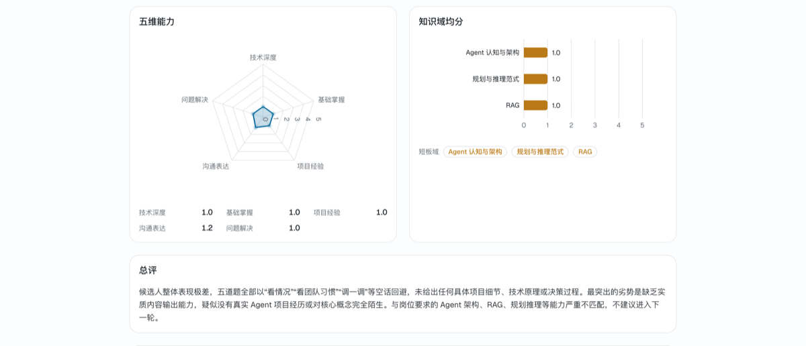
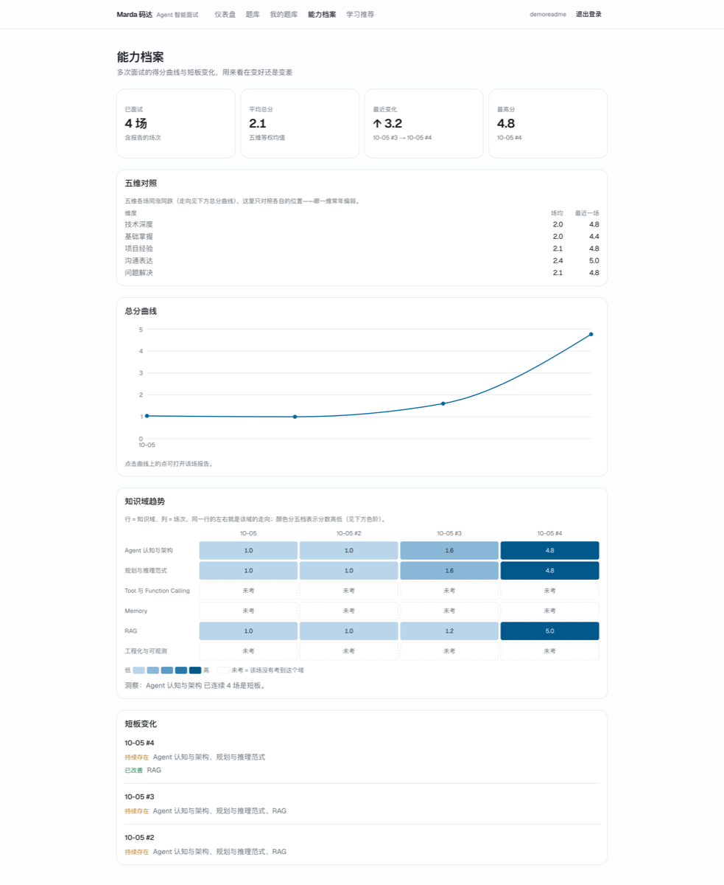
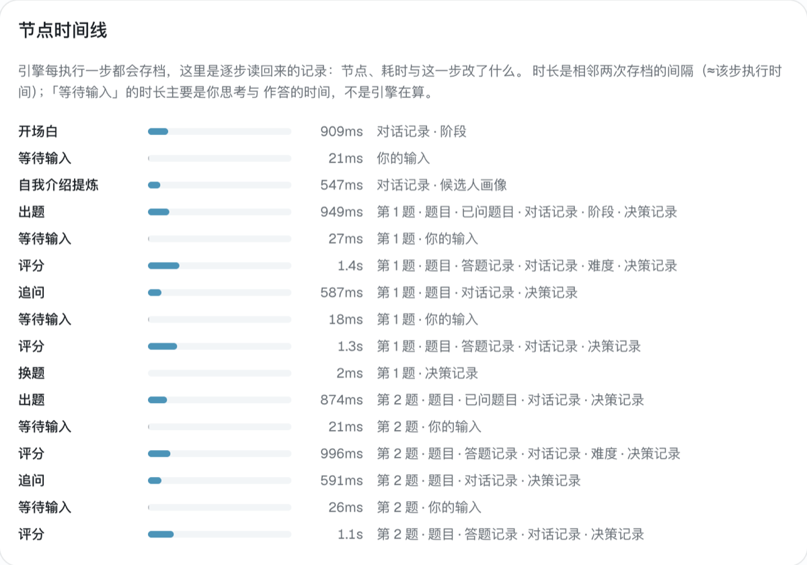
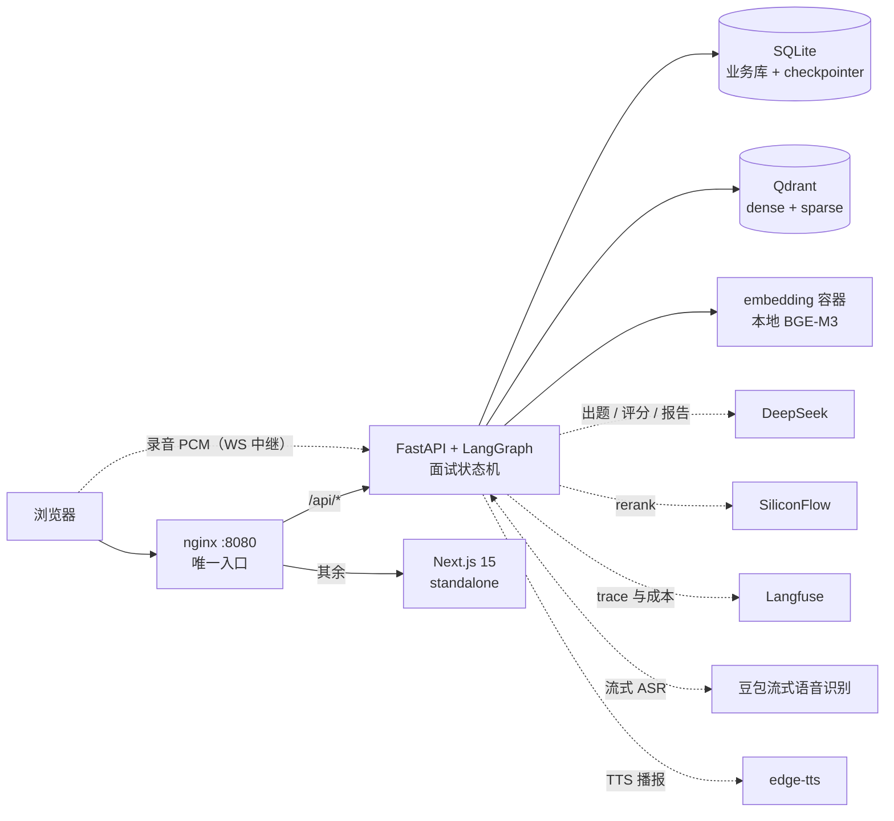

# Marda 码达


[](LICENSE)
[](https://github.com/Q-77-i/Marda/actions/workflows/ci.yml)

面向计算机学生的 **Agent 智能面试学习平台**。业务闭环：**模拟面试 → 发现短板 → 针对性学习**。

核心是一个 **Agent 智能面试引擎**——维护面试会话状态、自主出题、根据回答动态追问，而不是"智能客服式"的被动问答；RAG 检索作为 Agent 的一个工具参与出题与推荐。技术面与行为面跑在同一套状态机上。

> **校招简历副项目**：目标是可演示、可验收的端到端闭环（跑一场真面试 → 出报告 → 定位短板 → 推题），不是生产系统。开发过程见 [开发历程](docs/开发历程.md)。


## 演示

**创建**（技术面 / 行为面 · 5–15 轮 · 自适应或锁定难度 · 可选简历预填）→ **开场与自我介绍** → **项目深挖**（结合简历出定制题干）→ **技术问答**（同域成块、难度自适应、覆盖率不足则追问 / 答错先澄清）→ **反问** → **报告** → **学习推荐**与**能力档案**。

四条输入通道共用同一套引擎：文字 · **语音**（豆包流式识别 + edge-tts 播报，转写可改再发）· **截图**（评分官看图）· **摄像头**（UI 模拟，**帧不上传、不落库、AI 不看**）。面试页即**面试间**：面试官与候选人等大并列，状态徽标全部由现有状态派生——**多模态只是新增通道，图 / 状态机 / 落库 / SSE 事件表一条未动**。







## 核心亮点

- **Agent 面试引擎，不是 LLM 聊天壳**：LangGraph 状态机管编排（五阶段 + 追问循环 + 断线续面，行为面复用同一套），而**阶段推进 / 轮数上限 / 追问决策 / 域配额 / 难度升降全部是纯代码**——可解释、可单测、UI 可回放；LLM 只做出题、评分、追问文案。每次追问与换题的**原因与决策同源**（唯一实现 `explain_decision`），所以回放里的原因不是事后旁白。→ [SPEC §4](docs/SPEC.md)
- **RAG 是 Agent 的一个工具**：出题走「题库检索 → 难度放宽 → LLM 生成」三级降级；混合检索 = dense + sparse 服务端 RRF + rerank，**rerank 按查询形态开关**（多漏点长查询实测净贡献为负即不用，短查询保留）。语料 1568 题、一题可多源、来源四要素带 license。→ [SPEC §5](docs/SPEC.md)
- **质量是量出来的，不是感觉出来的**：检索侧四变体离线基线（NDCG / RAGAS，**噪声地板先量后用**）；评分侧自研一致性 harness + **门禁**（σ̄ / MAE 阈值，超限非零退出）。→ [SPEC §4.13](docs/SPEC.md)
- **全过程可回放**：决策回放事件流（出题 / 评分 / 追问 / 换题的决策与原因）+ 节点时间线（**零写入**派生自 checkpoint 历史，补上决策事件里没有的节点）；一次面试 = Langfuse 一个 trace，成本按场次读回。→ [SPEC §4.7](docs/SPEC.md)
- **断了也能用**：并发闸门 + 熔断 + 降级链——上游不可用时开场 / 出题 / 评分 / 报告全部走确定性兜底（**不调 LLM**），面试照常走完并**如实标注**；**未评分不产 0 分**，能力档案排除并说明。只降级「重试治不好」的失败，内容类错误仍走用户重试。→ [SPEC §3](docs/SPEC.md)
- **语料合规是红线**：开源语料白名单 + 每条带 `source/license/url`；个人题库与私有上传只本地使用，**派生文本同样不入 git**——提交前跑 `check_redline.py` 机械反查（两侧归一成中文骨架后滑 12 字窗口比对）。

## 架构



**设计原则**：确定性逻辑（阶段推进、轮数上限、追问决策、配额）全部用代码写死——可解释、可单测、UI 可回放；LLM 只负责出题、评分、追问文案这类语义任务。

## 快速开始

```bash
cp .env.example .env          # 填 DEEPSEEK_API_KEY / SILICONFLOW_API_KEY / JWT_SECRET
docker compose up -d --build  # → http://localhost:8080
```

`nginx（唯一入口）→ web（Next standalone）/ api（uvicorn）`，背靠 `qdrant` 与 `embedding`（本地 BGE-M3）共五个容器；业务库与 checkpointer 落宿主机 `data/`，容器重建不丢。语音 key 可选——不填则语音通道整体降级为文字，其余功能零影响。换端口：`MARDA_PORT=9000 docker compose up -d`。

**开发模式**（热重载）：

```bash
brew install pango && brew install --cask font-noto-sans-cjk-sc  # macOS：报告 PDF 导出所需
docker compose up -d qdrant embedding           # 向量库 + 嵌入服务
cd backend && uv sync && uv run uvicorn app.main:app --reload    # http://127.0.0.1:8000
cd frontend && pnpm install && pnpm dev                          # http://localhost:3000
```

密钥放仓库根 `.env`（见 `.env.example`，**不进仓库**）。`JWT_SECRET` 长度不足 32 会启动即失败；`LANGFUSE_*` 可选，留空即整体降级为零开销。

## 技术栈

| 层 | 选型 | 关键理由 |
| --- | --- | --- |
| 编排 | **LangGraph** 1.2 | 追问循环 + 断线续面需要状态机，checkpointer 原生支持 |
| 组件 | **LangChain** 1.4 | 切分器 / 加载器 / 工具装饰器，只在直线管道上用 |
| LLM | DeepSeek（`deepseek-flash` 主力 / `deepseek-v4-pro` 报告） | 双档控成本；flash 支持视觉，评分官得以看图 |
| 嵌入 | **本地 BGE-M3**（1024d，独立容器） | 一次前向出稠密 + 稀疏，省掉独立 BM25；模型自持，重嵌不依赖外部服务 |
| 向量库 | **Qdrant** 1.19 | 原生稀疏 + 服务端 RRF，混合检索不用换库 |
| 后端 | FastAPI + uvicorn + sse-starlette | Python 生态 + SSE 原生支持 |
| 前端 | Next.js 15 + TS + Tailwind + shadcn/ui + Recharts | App Router + AI 生态组件最全 |
| 可观测 | **Langfuse**（云形态） | 一次面试一个 trace：调用 / 成本按场次可查，面试过程可解释 |
| 语音 | **豆包流式识别** + **edge-tts** | 交互命门用付费流式（低延迟部分转写），播报用免费够用的；都只在独立通道上，挂了降级回文字 |
| 数据 | SQLite（业务库 + checkpointer 两个文件） | 单机 demo 形态；真要换 PG，业务库只有七表、checkpointer 有官方 saver |

## 项目结构

```
backend/            FastAPI + LangGraph
  app/              状态机（graph/）/ 提示词与 schema（agents/）/ RAG 与业务工具（tools/）
                    / 路由（api/）/ 服务层与落库 / PDF 渲染 / LLM 封装（llm.py）
  evals/            离线评测包（只被 scripts 调用，app 永不 import）
  scripts/          9 个真链路 smoke + 8 个 eval 与运维入口
data/
  scripts/          语料管道（bank → parse → combine → enrich → ingest）+ 改判 / 难度标注 / 红线检查
  curation/         人工改判表与难度标注表（key 是题干内容哈希）
  licenses/         语料来源清单与许可
frontend/           Next.js 15（九个路由 / lib 纯逻辑 / components）
docs/               PRD / SPEC / 开发历程
```

完整目录树与逐文件职责见 [SPEC §2](docs/SPEC.md)。

## 文档

- [docs/开发历程.md](docs/开发历程.md) — 每个里程碑做了什么、为什么这么定、怎么验证的（含失败的尝试与修正）
- [docs/PRD.md](docs/PRD.md) — 需求：功能清单、业务规则、页面、验收标准
- [docs/SPEC.md](docs/SPEC.md) — 技术规格：状态机 schema、规则、API 契约、数据库、前端设计、测试口径、风险清单
- [CLAUDE.md](CLAUDE.md) — 工程规约：协作方式、坑位清单、架构原则、语料红线
- [data/licenses/语料来源清单.md](data/licenses/语料来源清单.md) — 语料来源与许可
- [data/eval/summary.md](data/eval/summary.md) — 离线评估结论（纯数字，不含语料文本）

## 语料管道与合规

```bash
backend/.venv/bin/python data/scripts/parse_md.py      # 题库 md → 结构化 JSON
backend/.venv/bin/python data/scripts/parse_open.py    # 开源语料（四源）→ JSON，未采项逐项进报告
backend/.venv/bin/python data/scripts/combine.py       # 合并（自带个人题库零回归校验，不过则退出）
backend/.venv/bin/python data/scripts/enrich.py        # LLM 补关键点 / 预置追问（可断点续跑）
backend/.venv/bin/python data/scripts/ingest.py        # → SQLite + Qdrant 双写（含入库护栏）
```

**语料 1568 题（enabled 1096）**：个人题库 + 四源开源语料（均带明确 license，以 Agent 岗方向为主），全库按「L1 概念 / L2 原理与选型 / L3 底层与权衡」三档标注，12 个「难度 × 题量」组合全部可供。解析与合并口径见 [SPEC §6](docs/SPEC.md)。

**合规口径**：无 license / 非商用（NC）/ 来源不明的一律不入库；一题可有多源，来源明细进 `question_sources`（**license 按源记**）。**提交前做语料红线机械反查**：

```bash
backend/.venv/bin/python data/scripts/check_redline.py      # 查「现在提交会进仓库的改动」
backend/.venv/bin/python data/scripts/check_redline.py --all  # 全量自查
```

判据是把两侧归一成「只留中文字」的骨架再滑 12 字窗口（数字 / 标点 / 英文不切碎片段），命中即非零退出。**规则靠记忆执行不了**：这条检查立起来的第一件事，就是在已入库文件里查出 15 处遗留违规；后来又靠它查出检查器自己「关键点一条都没参与比对」的覆盖面漏洞。

## 验证与评估

```bash
cd backend
uv run pytest -q                              # 837 个测试（不需要任何密钥）
uv run python scripts/smoke_api.py            # 真链路走 HTTP 跑一场：报告 / PDF / 回放 / 推荐 / 档案核对
uv run python scripts/smoke_e2e.py            # 组合场：一场里语音进 / 语音出 / 截图 / 文字全跑通
uv run python scripts/smoke_degraded.py       # 降级链：假上游一律 503，一场面试仍能走完并如实标注
uv run python scripts/smoke_mcp.py            # MCP：stdio 子进程 + 真握手，三个工具各调一次
uv run python scripts/eval_retrieval_run.py   # 检索基线：四变体 × golden（需 Qdrant + 嵌入容器）
uv run python scripts/eval_judge_gate.py      # 评分门禁：超阈值非零退出（改评分 prompt 后必跑）

cd frontend && pnpm test && pnpm lint && pnpm build   # vitest 260 个 + lint + 构建
```

**离线评估不进 pytest 常规套件**（要真 Qdrant + 嵌入 + LLM，且门禁余量取自指标自身波动，会被上游抖动误伤）：检索侧出 NDCG / RAGAS 指标，评分侧出 σ̄（同题同答重复评 K 次的自波动）、MAE（vs 独立标注）与三档单调性。**先量噪声地板再读差值**——低于地板的「变化」不构成结论。命令与口径见 [SPEC §4.13](docs/SPEC.md)。

**CI** 跑不需要密钥的那一半：后端 pytest · 前端 lint + vitest + build · **语料入库守卫 + 红线检查器自检**。真比对与 smoke、评测不进 CI（语料不进仓库、真 key、花钱）。

## MCP 题库查询

题库检索能力按 **MCP** 暴露给任意客户端（Claude Code / Claude Desktop 等）：stdio 传输（本地子进程，题库不经过网络）、只读、**只暴露公共题**（私有上传连 id 都不可探测）。

```bash
claude mcp add marda-bank -- uv run --directory backend python -m app.mcp_server
```

三个工具：`search_questions`（混合检索）· `browse_questions`（按域/难度/公司/面次浏览）· `get_question`（单题 + 参考答案 + 关键点 + 来源四要素）。协议代码关在 `app/mcp_server/` 一个包里（单测扫描钉死别的模块不许 import `mcp`），规范版本锁 2026-07-28。

## 部署

演示形态就是本文档的「快速开始」一条命令（本地 Docker Compose）。**不上云、不迁移 PG**：面试现场共享屏幕演示 + 简历挂本仓库地址即可；PG 的真实价值（多 worker 共享状态 / 并发写）在单机 demo 下不成立，真要换时业务库只有七表、checkpointer 有官方 PG saver，替换面可控。两条已记下的口径：**nginx 是唯一入口**（`/api` 段关 `proxy_buffering` —— SSE 流式推送的前提，最大的部署风险在本地就验证掉）；**镜像是分架构的**（arm64 构建的镜像在 amd64 服务器上跑不了，需 `buildx --platform linux/amd64` 或在服务器上构建）。

## License

[MIT](LICENSE) © Zhouq。仓库内不含任何第三方语料原文。
