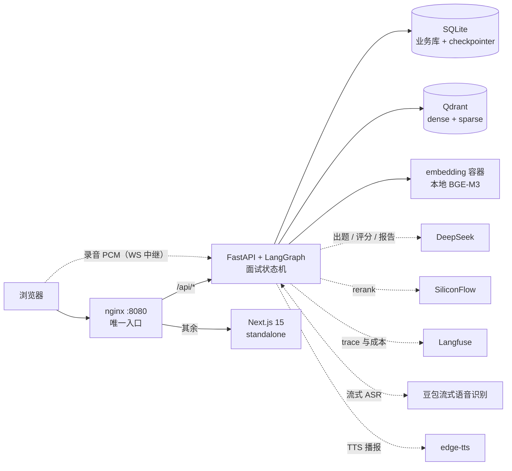

# Marda 码达


[](LICENSE)

面向计算机学生的 **Agent 智能面试学习平台**。业务闭环：**模拟面试 → 发现短板 → 针对性学习**。

核心是一个 **Agent 智能面试引擎**——维护面试会话状态、自主出题、根据回答动态追问，而不是
"智能客服式"的被动问答；RAG 检索作为 Agent 的一个工具参与出题与推荐。技术面与行为面跑在同一套状态机上。

> 校招简历副项目。目标是可演示、可验收的端到端闭环（跑一场真面试 → 出报告 → 定位短板 → 推题），不是生产系统。

## 演示

一场面试的用户可见闭环：

**创建**（技术面 / 行为面 · 5/10/15 轮 · 自适应或锁定难度）→ **开场与自我介绍** → **项目深挖**（结合自我介绍定制题干）→
**技术问答**（同域成块、难度自适应、覆盖率不足追问 / 答错澄清）→ **反问** → **报告**（五维雷达 + 逐题复盘 + 短板域 + 导出 PDF + 决策回放）
→ **学习推荐**（对着短板推题）与**能力档案**（多场曲线 / 热力图 / 短板变化）。

全程可切**语音通道**：开「语音模式」后面试官消息自动播报（edge-tts），点「语音作答」说话即以
豆包流式识别实时转写、**改完再发送**——引擎与模态解耦，文字/语音随时切换（语音不可用自动降级回文字）。
面试页即**面试间**：顶部双人舞台——面试官人像框（状态徽标：正在提问/聆听/播报）与我本机画面**等大并列**（
**帧不上传、不落库、AI 不看**）、截图随回答上传供评分官参考、控制条统一麦克风/摄像头/截图——
四条形态共用一套引擎（多模态只是通道，状态机与 SSE 事件表一条未动）。

本仓库暂无截图与录屏；拿到代码 3 分钟可自己跑出来（见「快速开始」）。

**架构**



## 核心亮点

- **Agent 面试引擎，不是 LLM 聊天壳**：LangGraph 状态机管编排（五阶段 + 追问循环 + 断线续面，行为面复用同一套），
  而**阶段推进 / 轮数上限 / 追问决策 / 域配额 / 难度升降全部是纯代码**——可解释、可单测、UI 可回放；LLM 只做出题、评分、追问文案。
  每次追问与换题的**原因与决策同源**（唯一实现 `explain_decision`），所以回放里的原因不是事后旁白。→ [SPEC §4](docs/SPEC.md)
- **RAG 是 Agent 的一个工具**：出题检索（题库 → 难度放宽 → LLM 生成三级降级）与混合检索
  （dense + sparse 服务端 RRF + rerank，**rerank 按查询形态开关**——长查询实测净贡献为负即不用，
  短查询保留）；语料 1568 题、一题可多源、来源四要素带 license。→ [SPEC §5](docs/SPEC.md) / [§6](docs/SPEC.md)
- **评估驱动的学习闭环**：报告五维评分 → 短板域与漏点关键词 → 混合检索推题 → 多场能力档案（曲线 / 热力图 / 短板变化）。
  总分口径后端单一来源，报告页、PDF、档案显示的是同一个数。→ [SPEC §4.10](docs/SPEC.md) / [§4.11](docs/SPEC.md)
- **质量是量出来的，不是感觉出来的**：检索侧四变体离线基线（NDCG / RAGAS，噪声地板先量后用）；
  评分侧自研一致性 harness + **门禁**（σ̄ / MAE 阈值，超限非零退出）。→ [SPEC §4.13](docs/SPEC.md)
- **语音只是加了一条通道，不是改了一个系统**：录音 → 流式 ASR → 同一引擎 → TTS 播报，
  图 / 状态机 / 落库 / SSE 事件表**一条未动**；音频不落盘不落库（内存转发即弃），
  转写文本**发送前可编辑**（ASR 错字不让评分官背锅）；ASR / TTS 任一不可用都降级回文字。
  → [SPEC §7 语音通道](docs/SPEC.md)
- **语料合规是红线**：开源语料白名单 + 每条带 `source/license/url`；个人题库与私有上传只本地使用，
  **派生文本同样不入 git**（提交前跑 `check_redline.py` 机械反查，见「语料管道与合规」）。

## 快速开始

### 一键起（演示 / 验收，Docker）

```bash
cp .env.example .env          # 填 DEEPSEEK_API_KEY / SILICONFLOW_API_KEY / JWT_SECRET（Langfuse 与语音 key 可选：
                              #   不填 VOLCANO_SPEECH_API_KEY = 语音通道整体降级为文字，其余功能零影响）
docker compose up -d --build  # → http://localhost:8080
```

`nginx（唯一入口） → web（Next standalone）/ api（uvicorn）`，背靠 `qdrant`（向量）与 `embedding`（本地 BGE-M3）——共五个容器；
业务库与 checkpointer 落宿主机 `data/`，容器重建不丢。首次构建要下载模型权重（数分钟）。换端口：`MARDA_PORT=9000 docker compose up -d`。

### 开发模式（热重载）

```bash
brew install pango && brew install --cask font-noto-sans-cjk-sc  # macOS：报告 PDF 导出所需
docker compose up -d qdrant embedding           # 向量库 + 嵌入服务（回环 6333 / 8091）
cd backend && uv sync && uv run uvicorn app.main:app --reload    # http://127.0.0.1:8000/healthz
cd frontend && pnpm install && pnpm dev         # http://localhost:3000
```

密钥放仓库根目录 `.env`（见 `.env.example`，**不进仓库**）：

```
DEEPSEEK_API_KEY=
SILICONFLOW_API_KEY=      # 只用于 rerank（嵌入走本地 BGE-M3 容器）
JWT_SECRET=               # 账号体系签名密钥，随机生成；长度不足 32 会启动即失败
                          # python3 -c "import secrets; print(secrets.token_urlsafe(48))"
LANGFUSE_PUBLIC_KEY=      # 可观测（可选）：留空即整体降级为零开销，本地/CI 无需账号
LANGFUSE_SECRET_KEY=
```

## 技术栈

| 层 | 选型 | 关键理由 |
| --- | --- | --- |
| 编排 | **LangGraph** 1.2.11 | 追问循环 + 断线续面需要状态机，checkpointer 原生支持 |
| 组件 | **LangChain** 1.4.0 | 切分器 / 加载器 / 工具装饰器，只在直线管道上用 |
| LLM | DeepSeek（`deepseek-flash` 主力 / `deepseek-v4-pro` 难题报告） | 双档控成本，快档跑高频、深度档跑报告 |
| 嵌入 | **本地 BGE-M3**（1024d，独立容器） | 一次前向出稠密+稀疏，省掉独立 BM25；模型自持，重嵌不依赖外部服务 |
| 向量库 | **Qdrant** | 原生稀疏+服务端 RRF，混合检索不用换库 |
| 后端 | FastAPI + uvicorn + sse-starlette | Python 生态 + SSE 原生支持 |
| 前端 | Next.js 15 + TS + Tailwind + shadcn/ui + Recharts | App Router + AI 生态组件最全 |
| 可观测 | **Langfuse**（云形态） | 一次面试一个 trace：LLM 调用/成本按场次可查，面试过程可解释 |
| 语音 | **豆包流式识别**（ASR）+ **edge-tts**（TTS） | 交互命门用付费流式（低延迟部分转写），播报用免费够用的；都只在一条独立通道上，挂了降级回文字 |
| 业务库 | SQLite（阶段 1）→ PostgreSQL | checkpointer 同步升级 |

**设计原则**：确定性逻辑（阶段推进、轮数上限、追问决策、配额）全部用代码写死——可解释、可单测、UI 可回放；
LLM 只负责出题、评分、追问文案这类语义任务。

## 项目结构

```
backend/            FastAPI + LangGraph
  app/              状态机（graph/）/ 角色提示词与 schema（agents/）/ RAG 与业务工具（tools/）
                    / 路由（api/）/ 服务层与落库 / PDF 渲染 / 依赖封装（llm.py）
  evals/            离线评测包（只被 scripts 调用，app 永不 import）
  scripts/          smoke 三件套 + eval 六件（检索基线 / RAGAS / 评分 golden / 运行 / 门禁）
data/
  scripts/          语料管道（bank 共享层 → parse → combine → enrich → ingest）+ 改判 / 红线检查
  curation/         人工改判表（domain/status 修正，key 是题干内容哈希）
  licenses/         语料来源清单与许可
frontend/           Next.js 15（九个路由 / lib 纯逻辑 / components）
docs/               PRD / SPEC
```

完整目录树与每个文件的职责见 [SPEC §2](docs/SPEC.md)。

## 语料管道与合规

```bash
backend/.venv/bin/python data/scripts/parse_md.py       # 题库 md → 结构化 JSON
backend/.venv/bin/python data/scripts/parse_open.py     # 四源开源语料 → JSON（未采项逐项进报告）
backend/.venv/bin/python data/scripts/combine.py        # 个人题库 + 开源语料合并（自带零回归校验）
backend/.venv/bin/python data/scripts/enrich.py         # LLM 补 key_points / follow_ups（可断点续跑）
backend/.venv/bin/python data/scripts/ingest.py         # → SQLite + Qdrant 双写（需 embedding 在跑）
# 入库护栏：题量与库内相差 >50% 直接停（公共题是全量同步语义，指错文件会整批删题；--force 越过）

# 只改判十来道题（归域/上下架）时不必重跑全链：改判表 → 已落库的库
backend/.venv/bin/python data/scripts/apply_overrides.py [--dry-run]

# 难度重标注（P2-M1）：批量标 + 校准报告 + 只改档位不重建向量库
backend/.venv/bin/python data/scripts/annotate_difficulty.py --select main   # 可断点续跑
backend/.venv/bin/python data/scripts/annotate_difficulty.py --report
backend/.venv/bin/python data/scripts/apply_difficulty.py [--dry-run]
```

**语料规模**：个人题库 342 题 + 四源开源语料 1229 题 = **1568 题（enabled 1096）**，开源语料以 Agent 岗方向为主；
模型层理论页落在未启用的 `cs-fundamentals` 域、以 draft 只进 SQLite（域启用时零重采成本）。
**难度**：全库按「L1 概念 / L2 原理与选型 / L3 底层与权衡」三档重标注（P2-M1，1002 题 LLM 标注 + 与真实标注源校准），
启用题 L1 125 / L2 623 / L3 348——12 个「难度 × 题量」组合全部可供（原 L3 × 15 直供不足已消除）。

**合规口径**：入库语料必须有明确 license，无 license / 非商用（NC）/ 来源不明的一律不入库；一题可有多源，
来源明细进 `question_sources`（四要素，**license 按源记**），`questions.source` 只存答案主源。
清单见 [data/licenses/语料来源清单.md](data/licenses/语料来源清单.md)；解析与合并口径见 [SPEC §6](docs/SPEC.md)。

**提交前检查（语料红线机械反查）**——个人题库与私有上传只本地使用，**派生文本同样不得入库**：

```bash
backend/.venv/bin/python data/scripts/check_redline.py          # 查「现在提交会进仓库的改动」
backend/.venv/bin/python data/scripts/check_redline.py --all    # 全量自查（发布前）
```

判据是把两侧归一成「只留中文字」的骨架再滑 12 字窗口（数字/标点/英文不切碎片段，技术词不误报），命中即非零退出。
**规则靠记忆执行不了**：这条检查立起来的第一件事，就是在已入库文件里查出 15 处遗留违规（均已改为抽象描述）。

## 验证与评估

```bash
cd backend
uv run pytest -q                              # 733 个测试（不需要任何密钥）
uv run python scripts/smoke_llm.py            # 只验 LLM 封装（一条 chat + 一条结构化）
uv run python scripts/smoke_graph.py          # 真实 DeepSeek + Qdrant 跑一场短面试
uv run python scripts/smoke_api.py            # 真实链路走 HTTP 跑一场 + 落库/回放/PDF/推荐/档案核对
SMOKE_QUESTION_COUNT=10 uv run python scripts/smoke_api.py   # 长场次：看同域成块、难度曲线与结束陈词
uv run python scripts/smoke_voice.py          # 语音通道：TTS 合成 → 喂回 ASR → 转写与原文对齐（需语音 key）
uv run python scripts/smoke_vision.py         # 图片通道：合成截图 → 上传 → 带图一场跑通（收尾回答须引用图内标识串）
```

```bash
cd frontend && pnpm test          # vitest 239 个：SSE 解析 / 流式渲染与打字机兜底 / 展示格式化 / 登录态 / 恢复策略 / 语音·摄像头·面试间判据 / 各页纯逻辑
pnpm lint && pnpm build
```

**离线评估**（P1-M12，命令见 [SPEC §4.13](docs/SPEC.md)）——评测要真 Qdrant + 嵌入 + LLM，故**不进 pytest 常规套件**，是显式命令：

```bash
cd backend
uv run python scripts/eval_retrieval_run.py            # 检索基线：四变体 × golden（需 Qdrant + 嵌入容器）
uv run python scripts/eval_ragas_context.py            # RAGAS：推荐内容对单条漏点的覆盖度
uv run python scripts/eval_judge_run.py --label before   # 评分一致性 / 准确性 / 单调性基线
uv run python scripts/eval_judge_gate.py               # 评分门禁：超阈值非零退出（改评分 prompt 后必跑）
# 评分官用图监控（P2-M6）：统计「judge 输出引用图内信息」比率；推荐容器内跑（checkpoints 是 WAL）
docker compose exec -T api /app/.venv/bin/python scripts/eval_judge_vision.py
```

## 文档

- [docs/PRD.md](docs/PRD.md) — 需求（FR-01~25、核心业务规则、验收标准、里程碑）
- [docs/SPEC.md](docs/SPEC.md) — 技术规格（状态机 schema、API 契约、数据库、前端设计、测试计划、评估体系）
- [CLAUDE.md](CLAUDE.md) — 工程规约与逐会话 changelog（开发过程的决策与踩坑，最详细的一份）

## 开发进度

阶段 1 demo 已完成（T1–T7b）；阶段 2（P1-M1~M12）全部完成并经全量验证（606 passed · vitest 167 · 三个 smoke · 评分门禁 7/7）：

| 里程碑 | 内容 |
| --- | --- |
| M1 | 面试复盘与回放（逐题复盘卡 / 只读回放 / 报告走 v4-pro） |
| M2 | 账号体系（JWT + 多用户隔离，登录注册页 + 路由守卫） |
| M3 | 混合检索与 rerank（本地 BGE-M3 双向量 + Qdrant RRF + SiliconFlow rerank） |
| M4 | Langfuse 可观测 + 决策回放事件流与 `/trace/[id]` 回放页 |
| M4.5–M4.7 | 出题接上下文 + 深挖追问 + 追问密度控制；阶段重排（项目深挖前置）；面试官人味层（同域成块） |
| M5 | `question_sources` 拆表（多源 provenance）+ 四源开源语料扩充（342 → 1571 题） |
| M6 | 题库页 + 容量校验（`/api/bank/*` 三端点、创建时可选难度） |
| M7 | 私有题库（模板上传与解析、混入式出题、`/bank/private` 管理） |
| M8 | 报告导出 PDF（服务端渲染真文本 PDF，pypdf 读回断言中文无乱码） |
| M9 | 学习推荐（短板域 + 漏点关键词驱动检索；并据此建人工改判表，把项目叙事题摘出技术域） |
| M10 | 能力档案（`/api/profile` 多场聚合，总分口径收敛到单一来源） |
| M10.5 | 档案前端改版（知识域热力图 / 五维对照表 / 一天一个标签） |
| M11 | 行为面 / HR 面（同一状态机换能力模型与题源，deepen-only 追问） |
| M12 | 评估体系（检索四变体基线 + RAGAS；评分一致性自研 harness + 门禁） |

阶段 3 + 二期（P2，多模态与企业级收尾）进行中：

| 里程碑 | 内容 |
| --- | --- |
| P2-M1 | 题库质量三连（全库难度重标注 1002 题；近似重复 3 对措辞级合并；行为题 6 道补讲述要点） |
| P2-M2 | 检索与推荐修复（长查询按形态跳过 rerank，missed_point NDCG@5 0.660 → 0.813；学习建议域结构化） |
| P2-M3 | 前端小修包（窄屏顶栏换行；能力档案补「报告缺失场次」说明与空态第三态） |
| P2-M4 | 模态层 + 真 token 流（SSE 新增 `delta_start`/`delta_chunk`，`delta` 语义不变；`chat()` 单一实现改流式聚合） |
| P2-M5 | 语音面试（FR-24）：`WS /api/asr` 中继豆包流式识别 + `POST /api/tts`（edge-tts）；转写可编辑、语音/文字双通道随时切 |
| P2-M6 | 视觉通道（FR-26）：代码截图随回答上传，评分官看图（`deepseek-flash` 视觉）、生成题结合上一题的图；图独立成消息附件、不改任何 prompt 模板 |
| P2-M7 | 摄像头 UI 模拟（FR-27）+ 面试间整合：舞台卡片（面试官人像框+状态徽标 ｜ 我 等大并列）+ 控制条；画面帧不上传、不落库、AI 不看；纯前端、后端零改动 |

逐步的决策、实测数据与踩坑记录见 [CLAUDE.md](CLAUDE.md) changelog；后续规划见 [docs/PRD.md](docs/PRD.md) §8。

## 部署：本地一键起（Docker Compose）

阶段 1 的部署形态就是这份编排 + 本地一键起（演示/验收即 `docker compose up -d --build`）；**服务器部署与部署方案随阶段 3 再定**，届时同一份编排直接复用。两条已记下的口径：**nginx 是唯一入口**（`/api` 段关 `proxy_buffering` —— SSE 流式推送的前提，最大的部署风险在本地就验证掉）；**镜像是分架构的**——Mac（arm64）本地构建的镜像在 amd64 服务器上跑不了，要么在服务器上构建，要么 `buildx --platform linux/amd64`。
