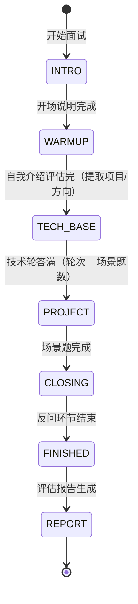

# PRD：Marda 码达 — Agent 智能面试学习平台

> 版本 v1.0 ｜ 2026-09-15 ｜ 状态：已评审通过 ｜ 上游：docs/规划报告.md（已确认）｜ 下游：SPEC

---

## 1. 产品概述

### 1.1 背景与问题

校招学生备考面试的两个痛点：
- **刷题 ≠ 会面试**：免费刷题只解决"知道答案"，练不出临场表达和抗追问能力；面试官不会照题库原题问（面试鸭官方自述）。
- **练完不知道差在哪**：市面上"录完给一次性反馈"的工具没有多轮状态，评完即止，缺"短板 → 学习"的闭环。

### 1.2 产品定位与差异化

面向计算机学生的 **Agent 智能面试学习平台**：不是被动问答的智能客服，而是一个会**自主出题、动态追问、维护整场面试会话状态**的 AI 面试官，面试后**定位能力短板并推送学习资料**，形成"模拟面试 → 发现短板 → 针对性学习"闭环。

差异化（相对开源同类）：
1. **可解释的追问决策状态机**：何时追问/追问多深/何时换题，由显式规则决定且全程可回放；
2. **校招岗位能力模型**：出题与评分都挂在"岗位 → 知识域 × 权重 × 难度"模型上（首批：Agent/AI 工程师）。

### 1.3 目标用户

- 主用户：备战中大厂校招的计算机学生（首批覆盖 Agent/AI 工程师岗位方向）。
- 演示受众：校招面试官（简历项目评审）。

### 1.4 业务闭环

```
创建面试 → Agent 面试（出题/追问/评分）→ 面试报告（雷达图+逐题点评+短板）
        → 学习资料推荐 → 再面试（能力曲线对比）
```

### 1.5 成功指标

| 指标 | 定义 | 目标（阶段 1） |
| --- | --- | --- |
| 面试完成率 | 完成整场面试并生成报告的场次占比 | ≥90%（默认配置下） |
| 追问规则符合率 | 追问行为符合规则表的转移占比（单测+人工抽样） | 100%（单测） |
| 出题来源占比 | 出题命中题库（含元数据筛选）的比例 | ≥90% |
| 首 token 延迟 | 用户发言到开始收到回复 | P95 < 3s（不含排队） |

---

## 2. 用户与场景

**画像**：应届生小 A，求职 Agent/AI 工程师岗位，刷过八股但没经历过真实追问，想评估自己的 Agent 知识掌握水平。

| 场景 | 描述 | 对应功能 |
| --- | --- | --- |
| A 考前模拟 | 面试前创建一场模拟面试，经历完整五阶段流程 | 面试引擎 |
| B 面试中应对追问 | 回答后被追问遗漏点/错误点，体验真实面试压力 | 追问决策 |
| C 中途打断 | 面试中途刷新页面/断网，回来后从原题继续 | 断线续面 |
| D 面试后复盘 | 查看雷达图、逐题点评，知道自己短板在哪 | 报告 |
| E 针对性学习 | 根据短板拿到对应知识点资料 | 学习推荐（P1） |
| F 能力追踪 | 多次面试后看能力曲线变化 | 能力档案（P1） |

---

## 3. 功能需求

> 优先级：P0 = 阶段 1（demo 最小闭环）；P1 = 阶段 2（完善）；P2 = 二期（多模态）。

### 3.1 面试引擎（P0）

| 编号 | 需求 | 说明 |
| --- | --- | --- |
| FR-01 | 创建面试 | 选择岗位方向（阶段 1：Agent/AI 工程师）、题量（**全场问答轮次**，默认 10 轮，可选 5/10/15；内部组成 9 技术 + 1 场景由引擎决定，不对用户暴露）、开始按钮；需登录（阶段 1 为单用户无登录，账号见 FR-23） |
| FR-02 | 五阶段面试流程 | 开场说明 → 自我介绍评估 → 技术问答 → 场景/项目深挖 → 反问与收尾（§4.1） |
| FR-03 | 自主出题 | 按能力模型（知识域 × 难度）从题库选题，优先未问过的题；题库无合适题时 LLM 生成（标记为草稿，不入正式库） |
| FR-04 | 动态追问 | 按追问决策规则（§4.2）对回答进行追问或换题 |
| FR-05 | 断线续面 | 面试中途刷新/断网后，回到原题继续，不丢历史 |
| FR-06 | 主动结束与超时保护 | 用户可随时结束面试并出报告（题量 ≥60% 时）；单题等待超时（默认 10 分钟）自动结束；LLM 异常时友好提示并可重试 |
| FR-07 | 流式回复 | 面试官消息打字机式流式展示 |
| FR-08 | 难度自适应 | 连续 2 题得分 ≥4 升一档难度；连续 2 题 ≤2 降一档（L1/L2/L3） |
| FR-09 | 跳过 | 用户说"跳过/不会"时记 1 分并标注 skipped，计入题量，换下一题 |

### 3.2 题库（P0 入库 / P1 完整）

| 编号 | 需求 | 优先级 | 说明 |
| --- | --- | --- | --- |
| FR-10 | 语料解析入库 | P0 | 解析三格式个人题库：md（面次→厂商→主题→题目层级）、xmind（zip 解包）、PDF（两份均因合规否决，不入库），产出结构化题目 JSON（§4.6 字段） |
| FR-11 | 题目元数据 | P0 | company / round / topic / domain / difficulty / source-license 元数据随题入库，驱动筛选与合规 |
| FR-12 | 题库浏览与搜索 | P1 | 按知识域/难度/厂商/面次筛选，关键词搜索 |
| FR-13 | 私有题库 | P1 | 上传 md/pdf 导入个人题目、管理（编辑/归档）；多用户时按用户隔离 |
| FR-14 | 容量校验 | P1 | 创建面试时校验：方向 × 难度 × 题数不足则禁用对应选项并提示 |

### 3.3 能力评估与报告（P0 基础 / P1 完整）

| 编号 | 需求 | 优先级 | 说明 |
| --- | --- | --- | --- |
| FR-15 | 逐题评分 | P0 | 每题按五维 rubric 打分（1-5 分，§4.4），结构化输出 |
| FR-16 | 五维雷达图 + 知识域聚合 | P0 | 总分、五维雷达图、各知识域得分分布 |
| FR-17 | 报告页 | P0 | 逐题点评（题目 + 考官点评）+ 短板定位（得分最低的 2-3 个知识域）+ 下次面试建议；回答复盘内容见 FR-25 |
| FR-18 | PDF 导出 | P1 | 报告一键导出 PDF（面试可展示亮点） |
| FR-19 | 能力档案与曲线 | P1 | 同一用户多次面试的得分曲线与短板变化对比 |
| FR-25 | 面试复盘与回放 | P1 | 报告页逐题复盘卡（我的回答 / 五维得分 / 关键点覆盖对比；题库题附参考答案全文，场景题仅关键点对比）+ 已结束场次面试页只读回放（完整对话，输入框隐藏），报告页与回放互链 |

### 3.4 学习推荐（P1）

| 编号 | 需求 | 说明 |
| --- | --- | --- |
| FR-20 | 短板→知识点→资料 | 报告短板 → 检索对应知识点资料卡片（题目/答案/参考链接），在报告页与学习页展示 |

### 3.5 Trace 回放（P1）

| 编号 | 需求 | 说明 |
| --- | --- | --- |
| FR-21 | 决策回放 UI | 逐轮展示「输入 / 节点决策 / 工具输出 / 状态变化 / 换题原因」，把"Agent 维护会话状态"变成可视化证据 |

### 3.6 面试范围扩展（P1）

| 编号 | 需求 | 说明 |
| --- | --- | --- |
| FR-22 | 行为面/HR 面 | 复用同一状态机与报告体系，仅能力模型不同（沟通/价值观/稳定性维度） |
| FR-23 | 账号体系 | 多用户注册登录（JWT），私有题库与面试历史按用户隔离 |

### 3.7 多模态（P2 二期）

| 编号 | 需求 | 说明 |
| --- | --- | --- |
| FR-24 | 语音面试 | 前端录音 → ASR → 同一面试引擎 → TTS 播报；引擎与模态解耦，文字/语音双通道可切换 |

---

## 4. 核心业务规则

### 4.1 面试阶段机



| 阶段 | 行为 | 计分 |
| --- | --- | --- |
| INTRO 开场 | 面试官自我介绍 + 流程说明，约 3 句话 | 不计 |
| WARMUP 自我介绍 | 候选人自我介绍 → 面试官提炼项目经历（供场景题定制追问） | 不计 |
| TECH_BASE 技术问答 | 按能力模型出技术题（默认 9 道，= 轮次 − 1 场景题），每题走"出题→作答→评分→追问决策"循环 | 计 |
| PROJECT 场景深挖 | 1 道高阶场景架构设计题，结合候选人项目经历，允许多轮追问 | 计 |
| CLOSING 反问 | 候选人向面试官提问 1-2 个，面试官作答 | 不计 |
| FINISHED→REPORT | 汇总评分 → 报告生成 | — |

### 4.2 追问决策规则（产品可见行为，确定性规则）

| 条件 | 决策 |
| --- | --- |
| 回答存在明确错误/自相矛盾（error_flag） | 追问澄清（每题上限 1 次） |
| 关键点覆盖率 < 70% | 追问遗漏关键点（每题上限 2 次） |
| 覆盖完整且质量达标 | 换题 |
| 单题追问次数达到上限（默认 3 次） | 换题（不向候选人暴露评价） |
| 阶段题量完成 | 进入下一阶段 |

### 4.3 出题规则

- 选题优先级：能力模型匹配（当前阶段 × 知识域 × 难度）→ 本轮未问过 → 随机。
- 题库无匹配题 → LLM 按同标准生成（结构化：主问题/关键点/参考答案），标记草稿不入正式库。
- 知识域权重决定各域题量分布（Agent 认知与架构 20% / RAG 20% / Tool 与 FC 15% / Memory 15% / 规划与推理 15% / 工程化与可观测 15%）。
- 知识域在题目 JSON 的 `domain` 字段标注，未标注的题由入库脚本按主题自动映射（映射表随 SPEC 定义）。

### 4.4 评分规则（1-5 分整数）

| 维度 | 定义 |
| --- | --- |
| 技术深度 | 是否触及原理/底层/设计权衡，而非停留在名词解释 |
| 基础掌握 | 概念准确性与完整性，关键点覆盖 |
| 项目经验 | 项目细节真实度、方案选择理由（技术题弱相关时按"实践迁移"评估） |
| 沟通表达 | 结构清晰、逻辑连贯、语言组织 |
| 问题解决 | 场景题的思路分解、边界条件考虑、方案比较 |

- 每题输出：五维分数 + 覆盖的关键点列表 + 遗漏关键点 + error_flag + 一句话点评。
- 报告总分 = 加权汇总（维度权重与技术题/场景题权重在 SPEC 定义）。

### 4.5 报告生成规则

- 结构：总览（总分/五维雷达/知识域分布）→ 逐题点评 → 短板定位（最低 2-3 个知识域）→ 学习建议 → 下次面试建议（难度/方向）。
- 生成时机：面试正常结束、用户主动结束（题量 ≥60%）、超时结束，均生成报告。

### 4.6 题目数据模型

| 字段 | 说明 | 必填 |
| --- | --- | --- |
| question | 主问题 | ✅ |
| answer | 参考答案 | ✅ |
| key_points | 关键点列表（评分依据） | ✅ |
| follow_ups | 预置追问集（评分官参考，非强制使用） | ✅ |
| domain | 知识域（六大域） | ✅ |
| topic | 知识主题（如 "RAG 切片粒度"） | ✅ |
| difficulty | L1/L2/L3 | ✅ |
| company | 来源厂商（可空） | 否 |
| round | 一面/二面/三面（可空） | 否 |
| source / license / url | 来源合规三要素 | ✅ |
| status | 草稿 / 启用 / 归档 | ✅ |

---

## 5. 页面与交互

| 页面 | 功能 | 优先级 |
| --- | --- | --- |
| 仪表盘 | 创建面试（方向/题量）、历史面试列表、进入报告 | P0 |
| 面试页 | 聊天流（打字机流式）、当前阶段与进度指示（如 "技术问答 7/10"）、主动结束按钮、断线恢复提示；已结束场次只读回放（P1，FR-25） | P0/P1 |
| 报告页 | 雷达图（Recharts）、知识域分布、逐题点评、短板、下次建议、PDF 导出按钮（P1）；逐题复盘卡（P1，FR-25） | P0/P1 |
| 题库页 | 筛选/搜索/详情；私有题库上传管理（P1） | P1 |
| Trace 回放页 | 逐轮决策回放（输入/决策/工具输出/状态变化） | P1 |
| 能力档案页 | 历史曲线、短板变化 | P1 |

设计基调：参考 taste-skill 的高端质感（克制配色、强排版、微动效），面试页为专注型对话布局。

---

## 6. 非功能需求

| 类别 | 要求 |
| --- | --- |
| 性能 | 首 token P95 < 3s；追问决策（纯代码）< 100ms；报告生成 < 60s；面试页交互流畅 |
| 可用性 | 断线续面；LLM 异常可重试；阶段 3 接入降级链（v4-pro → flash → 预置题库兜底）与限流/熔断 |
| 安全 | .env 密钥不进 git、不打印；基本 prompt injection 防护（候选人输入视为数据，不改变面试流程决策）；个人题库仅本地 |
| 合规 | 语料白名单制（CLAUDE.md 红线）；每条题目带 source/license/url |
| 可观测 | 一次面试 = 一个 Langfuse trace；token 成本可统计（阶段 2 接入，阶段 1 预留埋点） |
| 部署 | 阶段 1 交付 Docker Compose 编排并**本地一键起**（nginx 唯一入口；数据与密钥挂宿主机）；服务器部署与部署方案随阶段 3 再定（§8）；浏览器 Chrome/Edge 现代版本 |

---

## 7. MVP（阶段 1）范围与验收标准

**In scope**：FR-01~09、FR-10、FR-11、FR-15、FR-16、FR-17；页面：仪表盘 + 面试页 + 报告页。

**Out of scope（阶段 2+）**：题库浏览/私有题库/账号、PDF 导出、学习推荐、Trace 回放、能力曲线、行为面、语音。

**验收标准（全部满足才算阶段 1 完成）**：

1. 题库 ≥100 题结构化入库（来源：个人题库 md/xmind 两格式解析，PDF 因合规否决），字段完整率 ≥95%，解析脚本有单测；
2. 默认配置 **10 轮问答**（内部组成 9 技术 + 1 场景，组成是引擎事务）完整跑通一场面试，全程流式，无中断；
3. 追问行为符合 §4.2 规则表——全部状态转移有单测覆盖并通过；
4. 面试中途刷新页面可续面（回到原题，历史不丢）；
5. 每场面试生成报告：五维评分 + 逐题点评 + 短板定位，数据与面试记录一致；
6. 出题 ≥90% 命中题库（按 domain/difficulty 筛选，不重复出题）；
7. LLM 调用异常时前端有友好提示，可重试；
8. P95 首 token < 3s（阶段 1 在开发环境实测；部署环境实测随阶段 3 验收）。

---

## 8. 里程碑

| 阶段 | 内容 | 周期 |
| --- | --- | --- |
| 阶段 0 | 规划/CLAUDE.md/PRD/SPEC | 已基本完成 |
| 阶段 1 | demo 最小闭环（§7 范围） | 1-2 周 |
| 阶段 2 | 功能完善：混合检索+rerank、行为面、账号、私有题库、PDF、Trace 回放、能力曲线、评估体系（DeepEval/RAGAS）、Langfuse（细化见 §8.1） | 2-4 周 |
| 阶段 3 | 可落地：部署上线（服务器与部署方案届时评估）、稳定性全链路（限流/重试/熔断/降级）、PG 迁移（业务库+checkpointer）、README 演示脚本 | 1-2 周 |
| 二期 | 语音面试（引擎与模态解耦） | 阶段 3 后 |

### 8.1 阶段 2 细化（2026-09-23 已拍板）

排序原则：先让已有闭环更可信 → 再扩数据与功能面 → 最后深化闭环与质量门禁；FR-25 先行、账号第二（理由见拍板记录）。

| M | 内容 | 依赖 | 验收要点（摘要，执行时细化为 TDD 用例） |
| --- | --- | --- | --- |
| P1-M1 | FR-25 复盘回放 + 报告换 v4-pro（1 会话） | — | 报告 payload 新字段齐、条数=已答题数；旧场次前端兜底；回放只读；pytest/smoke 通过 |
| P1-M2 | FR-23 账号：JWT + 多用户隔离（2 会话） | — | A 看不到 B 的场次（集成测试）；未登录 401；全量测试绿 |
| P1-M3 | 混合检索 + rerank：本地 BGE-M3 双向量 + Qdrant RRF + SiliconFlow rerank（2 会话） | — | **基础设施就位**：324 题（342 − 18 draft）重嵌 dense+sparse 双向量、embedding 独立容器、hybrid_search 接口；RRF+rerank 相关性抽查通过。**用户可见零变化**——出题无查询文本、不走向量，「用户能搜题」是 M6 的验收 |
| P1-M4 | Langfuse + Trace 回放 FR-21（1–2 会话） | — | Langfuse 按场次可查 trace；新场次逐轮回放完整 |
| P1-M5 | WenQu 扩充 + question_sources 拆表（1–2 会话） | M3 | 拆表后出题/检索无回归；字段完整率 ≥95%；幂等 |
| P1-M6 | 题库页 FR-12 + 容量校验 FR-14（1 会话） | M5 | 筛选/搜索 API 测试通过；容量不足禁用+提示 |
| P1-M7 | 私有题库 FR-13（1 会话） | M2/M6 | 上传→入库→管理闭环；A 的私有题 B 不可见 |
| P1-M8 | PDF 导出 FR-18（1 会话） | M1 | 导出内容完整（雷达图/点评/短板）、中文无乱码 |
| P1-M9 | 学习推荐 FR-20（1 会话） | M3/M1 | 推荐卡片与短板域相关（抽查） |
| P1-M10 | 能力档案 FR-19（1 会话） | M2 | 多场得分曲线与短板变化正确 |
| P1-M11 | 行为面 FR-22（1–2 会话） | M2/M1 | 一场行为面跑通（新维度评分+雷达图）；不混入技术面出题池 |
| P1-M12 | 评估体系 DeepEval/RAGAS（1–2 会话） | M3/M5 | 评分一致性/检索指标可重复输出 |

**P1 收尾专项（不占 M 编号）**：报告页视觉升级——统一设计语言、信息层级重排、空/加载/错误态、微动效。**时机：M2/M7/M9 页面结构定型后一次性做，不边做边磨**（结构还会变，先磨视觉即返工）。

拍板记录（2026-09-23）：

1. **FR-25 先行、账号第二**：复盘契约与 user 维度正交、零返工；「账号先于挂 user 的功能」的约束由 M2 位置满足；
2. **PG 迁移推阶段 3**：与部署一次切（业务库+checkpointer 同步），阶段 2 保持 SQLite、只做 DB 抽象预留；
3. **「多方向能力模型」= 仅行为面**（FR-22）；新增技术岗位方向需先补 PRD；
4. 真 token 流、MCP server 均推 P2；
5. M2 实现期定：历史场次归属、密码哈希选型（推荐 hashlib.scrypt + PyJWT）。

---

## 9. 风险与依赖

| 风险 | 影响 | 应对 |
| --- | --- | --- |
| DeepSeek 思考模式与结构化输出不兼容 | 评分/报告节点报错 | 结构化节点显式关 thinking |
| 语料合规（GPL/NC 传染） | 简历项目可被质疑 | 白名单制 + 三要素元数据；个人题库不进 git |
| 评分一致性（同一回答两次评分波动） | 能力曲线失真 | 固定 rubric + 低温结构化输出；阶段 2 golden set 校验 |
| 部署机资源（阶段 3，2-4G 量级） | 组件超内存 | Langfuse 用云形态；嵌入走 API；Qdrant 量化 |
| 个人题库质量（题量大、含长文） | 入库字段不整 | 解析脚本单测 + 字段完整率验收（≥95%） |

---

## 10. 待确认项（已给默认值，评审时可直接改）

1. 默认题量：**10 轮问答**（可选 5/10/15；题量语义 = 全场问答轮次，内部组成 9 技术 + 1 场景由引擎决定）；
2. 评分制：**1-5 分整数**；
3. 阶段 1 首页形态：**最小仪表盘**（创建面试 + 历史列表），不做完整首页营销页；
4. 跳过计分：跳过记 1 分并标注 skipped；
5. 报告是否可编辑/补充备注：阶段 1 不做。
