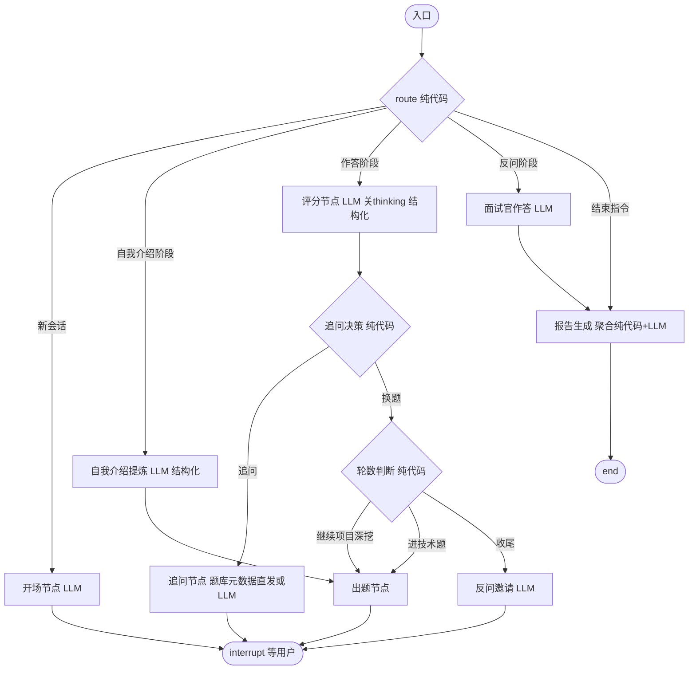

# SPEC：Marda 码达 — 技术规格（阶段 1 MVP）

> 版本 v1.0 ｜ 2026-09-15 ｜ 状态：已评审通过 ｜ 上游：docs/PRD.md（已评审通过）｜ 范围：阶段 1 demo 最小闭环

---

## 1. 范围与目标

**本文档 = 系统的技术规格（现行口径）**：状态机 schema、规则、API 契约、数据库、前端设计、测试口径、风险纪律。阶段 1（demo 闭环，T1–T7b）与阶段 2（P1-M1~M12）均已完成并全量验证——[README](../README.md) 是门面与快速开始，[CLAUDE.md](../CLAUDE.md) 是工程规约与全量 changelog，本文档负责「现在是什么样、为什么」。

**读法**：正文各节内的 `P1-Mx` 标记 = 该口径由哪次会话落地；§12 是改动索引（一行一条），理由与踩坑过程在 CLAUDE.md 与 `docs/private/踩坑记录.md`。

**下一步（阶段 3 → 二期）**：摄像头 UI 模拟（FR-27）+ 面试间整合、服务器部署与稳定性（限流/重试/熔断/降级链）、PG 迁移（业务库 + checkpointer 同步）。**视觉通道（FR-26）已落地**（P2-M6，见 §7 图片通道），**语音（FR-24）已落地**（P2-M5，见 §7 语音通道），**真 token 流已落地**（P2-M4）。原「阶段 1 不做清单」（账号体系 / 混合检索 / reranker / 私有题库 / PDF 导出 / Trace 回放 / 行为面 / Langfuse / MCP）**已全部落地**，口径在 §4–§8。

## 2. 工程结构

```
marda/
├── CLAUDE.md / .gitignore / .env(.example)
├── docs/             # 规划报告（个人留档）、PRD、SPEC
├── backend/
│   ├── pyproject.toml            # uv 管理，Python 3.11+
│   ├── app/
│   │   ├── main.py               # FastAPI 入口
│   │   ├── config.py             # env 读取（.env）
│   │   ├── llm.py                # DeepSeek 统一封装（openai SDK + base_url）
│   │   ├── observability.py      # Langfuse 接入（trace 上下文 / 无 key 降级，P1-M4）
│   │   ├── domain.py             # 知识域定义（配额 / 映射单一来源）
│   │   ├── api/                  # interviews / auth / bank / bank_private / profile / voice（SSE 在 interviews，WS 在 voice）
│   │   ├── graph/                # state.py / graph.py / nodes/（含 judge.py）/ rules/（追问/难度/配额/推进/聚合/衔接）
│   │   ├── agents/               # prompts.py / schemas.py（出题与评分的提示词模板与结构化输出 schema）
│   │   ├── tools/                # question_search（出题检索）/ hybrid_search / embedding / rerank / bank_query / bank_private / private_parse / recommend / profile / question_text（实质答案判定的共享口径）/ asr（火山 v3 二进制协议）/ tts（edge-tts，P2-M5）
│   │   ├── templates/            # report.html.j2（PDF 模板）
│   │   ├── report_pdf.py         # 报告 PDF 渲染（jinja2 + weasyprint + 手绘雷达 SVG，P1-M8）
│   │   ├── security.py           # 密码哈希（scrypt）与 JWT（P1-M2）
│   │   ├── service.py            # 服务层（图单例 / 事件翻译 / 落库）
│   │   └── db.py                 # 业务库六表（questions / question_sources / users / interviews / answers / reports）
│   ├── evals/                    # 离线评测包（只被 scripts 调用，app 永不 import，P1-M12）
│   ├── scripts/                  # smoke_llm / smoke_graph / smoke_api / smoke_voice + eval_build_golden / eval_retrieval_run / eval_ragas_context / eval_judge_golden / eval_judge_run / eval_judge_gate
│   └── tests/                    # unit/ integration/ fixtures/
├── frontend/                     # Next.js 15 + TS + Tailwind + shadcn/ui + Recharts（pnpm）
│   ├── app/                      # 九个路由：login / 仪表盘 / bank / bank/private / profile / learn / interview/[id] / report/[id] / trace/[id]
│   ├── components/               # 页面客户端组件 + 共享件（PageShell / PageHeader / EmptyState / ErrorState / StatusBanner / InlinePanel）+ ui/
│   ├── public/asr-worklet.js     # 录音采集 worklet（AudioWorklet 只能加载独立文件，P2-M5）
│   └── lib/                      # sse / typewriter / api / http / session / auth / bank / learn / profile / trace / recovery / download / format / constants / chart-tokens / voice（音频数学与落框）/ asr-client / tts
├── data/
│   ├── scripts/                  # bootstrap / mapping / bank（共享层）/ parse_md / parse_xmind / parse_open / combine / enrich / ingest / apply_overrides / enable_behavioral / check_redline
│   ├── curation/                 # 人工改判表（question_overrides.json）
│   ├── eval/                     # 评测产物：summary.md 入库，golden/ 与 results/ gitignore（P1-M12）
│   ├── parsed/                   # 解析产物（gitignore）
│   ├── raw/                      # 开源语料原仓（gitignore）
│   └── licenses/                 # 语料来源清单（入库）
├── docker/
│   └── nginx.conf                # 唯一入口：/api → api，其余 → web（本地与阶段 3 同构）
└── docker-compose.yml            # nginx + web + api + qdrant + embedding 一键起
```

- 后端依赖：fastapi、uvicorn、sse-starlette、langgraph==1.2.11、langchain==1.4.0、langgraph-checkpoint-sqlite==3.1.1、openai（SDK）、pydantic、pydantic-settings、tenacity、httpx、qdrant-client、pypdf、pyjwt（P1-M2）、python-multipart（P1-M7 上传）、weasyprint + jinja2（P1-M8 PDF）、langfuse==4.9.1（可观测，P1-M4）、edge-tts + websockets（语音，P2-M5）、sqlite3（内置）；评测依赖（ragas 等）在 dev 组，容器 `uv sync --no-dev` 不进镜像（§4.13）
- 前端依赖：next@15、react 19、tailwindcss v4、shadcn/ui（@base-ui/react）、framer-motion、recharts、tw-animate-css、lucide-react
- 阶段 1 存储：**SQLite 单文件**（业务库 + LangGraph checkpointer 两个文件），Qdrant 单容器（向量）；PG 阶段 2/3 引入
- 嵌入：**本地 BGE-M3 独立容器**（M3 起，`backend/embedding_service/`，torch 不进 api 镜像）；SiliconFlow 只留 rerank

## 3. LLM 集成（llm.py）

- 统一封装 `openai` SDK：`base_url="https://api.deepseek.com"`，`api_key` 从 .env 读。
- 模型：`deepseek-flash`（阶段 1 全部调用；v4-pro 阶段 2 用于报告）。
- **所有调用关 thinking**（`extra_body={"thinking": {"type": "disabled"}}`），规避坑位清单 1/2；要开思考模式是独立决策（结构化节点与流式展示都不兼容它）。
- 两个函数：
  - `chat(messages, *, max_tokens, temperature, model, on_delta) -> str`：文案类（开场/出题/追问/结束语）。**内部走流式**（P2-M4）：`stream=True` + `stream_options={"include_usage": True}`（usage 随末帧单发，**Langfuse 成本归因的硬前提**），逐块回调 `on_delta`（默认 None = 不回调，evals/脚本不受影响）。空输出重请求 1 次**只在一个字都没吐时**——已吐字的重发会把同一段说两遍
  - `chat_json(messages, *, schema: type[BaseModel]) -> BaseModel`：结构化类（评分/提炼/报告），**非流式**（`json_object` + JSON Schema 注入 prompt + Pydantic 校验 + 失败重请求 1 次）——结构化输出没有增量语义，展示类才有
- 重试：429/5xx tenacity 指数退避（阶段 1 只做重试，限流/熔断阶段 3）。**流式的重试只覆盖建连段**（建立连接 + 拿到响应头）：一旦开始吐字，重试就是重复输出，中途断流直接抛（用户侧「重试」= 重跑失败节点，§7）。
- 调用点全部走 `LLMError` 自定义异常 → API 层转 SSE error 事件。
- **单一实现纪律**：展示类文案只有 `chat` 一条路径——流式与非流式若各写一套，关 thinking / 空输出重请求 / 错误映射三处会各自漂移（`overall_score` 三处消费的教训同款）。

## 4. 面试状态机（LangGraph）

### 4.1 State

```python
class Phase(str, Enum):
    INTRO="intro"; WARMUP="warmup"; TECH_BASE="tech_base"
    PROJECT="project"; BEHAVIORAL="behavioral"   # P1-M11：行为面场次的问答段（取代 PROJECT+TECH_BASE）
    CLOSING="closing"; FINISHED="finished"

class BaseScore(BaseModel):                      # P1-M11：两种评分的公共部分
    covered_key_points: list[str]; missed_key_points: list[str]
    error_flag: bool; comment: str               # coverage 为派生属性

class ScoreItem(BaseScore):                      # 技术面（默认）
    technical_depth: int; fundamentals: int; project_experience: int
    communication: int; problem_solving: int            # 1-5 整数

class BehavioralScoreItem(BaseScore):            # 行为面（P1-M11）：第 3 维与技术面同名同义（跨类型对照）
    communication: int; logic_structure: int; project_experience: int
    values_motivation: int; career_stability: int

class QuestionRecord(BaseModel):
    question_id: str | None; text: str; domain: str; topic: str
    difficulty: str; key_points: list[str]
    follow_up_count: int = 0; clarify_used: int = 0; missing_used: int = 0
    followup_log: list[str] = []   # 评分节点需要追问记录（§4.5）
    answer: str | None = None      # 我的回答（含追问轮）：首答 + 「【追问补充】」标记追加（FR-25 复盘分段依据）
    image_ids: list[str] = []      # P2-M6 FR-26：该题回答附带的截图 id（跨追问轮累积；只存 id，文件在磁盘）
    score: ScoreItem | BehavioralScoreItem | None = None   # 按字段集自动落到对应模型（两套维度的必填字段不重叠）
    skipped: bool = False; from_bank: bool = True
    question_type: str = "tech"    # 题型语义（tech/scenario/behavioral 均计入问答轮次，编号见 §4.6；默认值兼容旧 checkpoint）

class InterviewState(BaseModel):
    interview_id: str; position: str
    interview_type: str = "tech"   # P1-M11 FR-22：tech / behavioral（与 position 正交；默认值兼容旧 checkpoint）
    question_count: int = 10   # 全场问答轮次（P1-M4.6-C 组成 = 项目深挖 project_count(N) + 技术 N−project_count(N)，见 domain.project_count）
    phase: Phase = Phase.INTRO
    current_question: QuestionRecord | None = None
    asked_ids: list[str] = []
    difficulty: str = "L1"
    difficulty_locked: bool = False      # 固定难度场次（P1-M6 FR-14）：用户选了 L1/L2/L3 则全程不升降
    consecutive_good: int = 0; consecutive_bad: int = 0
    candidate_profile: str = ""          # 自我介绍提炼
    answered_count: int = 0
    answered_questions: list[QuestionRecord] = []  # 报告聚合数据来源
    user_input: str = ""                 # resume 消息（route 分发依据）
    current_images: list[str] = []       # P2-M6 FR-26：本轮消息附带的截图 id（pause 节点写入，评分/追问消费后归并到题）
    closing_question_count: int = 0      # 反问计数（PRD §4.1 上限 1-2）
    chat_history: list[dict] = []        # 完整对话流水（回放 + SSE 差分的单一来源，不截断）
    report: dict | None = None
    status: str = "running"              # running / finished
    trace_log: list[dict] = []           # 决策回放事件流（FR-21，P1-M4）：只增不改，见 §4.7
```

Checkpointer：`langgraph.checkpoint.sqlite.AsyncSqliteSaver`（独立 sqlite 文件），`thread_id = interview_id`。

### 4.2 图结构


```mermaid
flowchart TD
    S([入口]) --> ROUTE{route 纯代码}
    ROUTE -- 新会话 --> INTRO[开场节点 LLM] --> INTERRUPT([interrupt 等用户])
    ROUTE -- 自我介绍阶段 --> PROFILE[自我介绍提炼 LLM 结构化] --> ASK[出题节点]
    ROUTE -- 作答阶段 --> JUDGE[评分节点 LLM 关thinking 结构化]
    JUDGE --> FD{追问决策 纯代码}
    FD -- 追问 --> FU[追问节点 题库元数据直发或LLM] --> INTERRUPT
    FD -- 换题 --> ADV{轮数判断 纯代码}
    ADV -- 继续项目深挖 --> ASK
    ADV -- 进技术题 --> ASK
    ADV -- 收尾 --> CLOSING[反问邀请 LLM] --> INTERRUPT
    ROUTE -- 反问阶段 --> CANS[面试官作答 LLM] --> REPORT[报告生成 聚合纯代码+LLM]
    ROUTE -- 结束指令 --> REPORT
    ASK --> INTERRUPT
    REPORT --> E([end])
```

**节点职责与决策全在代码，LLM 只产出文案与评分。** 单 interrupt 点（`interrupt()` 等待用户输入），resume 时由 route 按 phase 分发。`recursion_limit` 显式设为 `question_count*6+10`，捕获 `GraphRecursionError`。

### 4.3 纯代码规则模块（TDD 核心，graph/rules/）

**follow_up.py**：**决策与原因同源**（P1-M4）——`explain_decision` 是唯一实现，返回 `(Decision, Reason)`；`decide_follow_up` 只是取决策的薄封装，回放展示的换题原因与当时的决策不可能漂移。

```python
class Reason(str, Enum):   # 决策原因（回放展示 / 报告口径）
    ERROR_FLAG; COVERAGE_LOW; DEEPEN_OK          # → 追问
    REMEDY_LIMIT; CLARIFY_LIMIT; MISSING_LIMIT; MISSING_ASKED; COVERAGE_OK; DEEPEN_LIMIT  # → 换题
    # TOTAL_LIMIT 为 P0 遗留值（旧事件数据），不再产出；DEEPEN_LIMIT = 行为面 deepen-only 下深挖用尽（P1-M11）

def remedy_budget(question_count): return max(3, ceil(question_count * 0.7))
    # 全场补救预算（P1-M4.5-R1）：5 题 4 次 / 10 题 7 次 / 15 题 11 次；单一来源（仿 end_quota）
def remedy_used_total(state): return sum(q.missing_used for q in state.answered_questions)
    # 补救已用量从已答题计数派生（含当前题），零独立 state 字段；澄清/深挖豁免，skipped 自然不计
def unasked_missed(score, asked): return [k for k in score.missed_key_points if k not in asked]
    # 同一 key_point 只追问一次（覆盖率跳变不触发重复追问）

def explain_decision(score, *, question_count, clarify_used, missing_used, deepen_used, remedy_used, asked_key_points, rules, deepen_only=False) -> tuple[Decision, Reason]:
    # 优先级（P1-M4.5-R1）：澄清（不占池）→ 深挖（达标，不占池）→ 遗漏（占池）→ 换题
    if deepen_only:   # P1-M11 行为面：只深挖一次，其余分支全部不适用（见 §4.12）
        if deepen_used < rules.deepen_limit:  return Decision.DEEPEN, Reason.DEEPEN_OK
        return Decision.NEXT, Reason.DEEPEN_LIMIT
    if score.error_flag and clarify_used < rules.clarify_limit:  return Decision.CLARIFY, Reason.ERROR_FLAG
    if score.error_flag:  return Decision.NEXT, Reason.CLARIFY_LIMIT      # 错误仍在 → 换题（不深挖）
    if score.coverage >= rules.coverage_threshold:
        if deepen_used < rules.deepen_limit:  return Decision.DEEPEN, Reason.DEEPEN_OK
        return Decision.NEXT, Reason.COVERAGE_OK
    unasked = unasked_missed(score, asked_key_points)
    if unasked and missing_used < rules.missing_limit:
        if remedy_used < remedy_budget(question_count):  return Decision.MISSING, Reason.COVERAGE_LOW
        return Decision.NEXT, Reason.REMEDY_LIMIT
    if missing_used >= rules.missing_limit:  return Decision.NEXT, Reason.MISSING_LIMIT
    return Decision.NEXT, Reason.MISSING_ASKED   # 有遗漏但遗漏点均已追问过

def decide_follow_up(...) -> Decision:   # 薄封装：decision, _ = explain_decision(...)
```

**追问密度口径（P1-M4.5-R1，实测 3 题 10 次追问后修订）**：单题上限 澄清 1 / 遗漏 2 / 深挖 1（单题最大 5 轮 = 首答 + 澄清 1 + 遗漏 2 + 深挖 1）；全场补救池 `remedy_budget` 管总量，澄清（error 纠错）与深挖（边界深挖）豁免——两者由单题上限约束、不占池。

**difficulty.py**：

```python
def update_difficulty(state) -> None:
    if state.difficulty_locked: return    # 固定难度场次不升降（P1-M6 FR-14）
    mean = score 五维均值
    if mean >= 4: good+1, bad=0
    elif mean <= 2: bad+1, good=0
    else: reset both
    good>=2 → difficulty 升一档（封顶 L3）并清零；bad>=2 → 降一档（保底 L1）并清零
```

**difficulty_locked 的分工**：落库列 `interviews.difficulty` 存的是**用户的选择**（`adaptive`/`L1`/`L2`/`L3`，列表页据此回显），`state.difficulty` 存**当前档位**（自适应场次会升降）。`adaptive` 起步档 = `base_difficulty()` = L1——它同时是「自适应」的起点与 L1 固定场次的档位，所以容量校验里 adaptive 与 L1 的结论必须一致（smoke 用真实题库断言这一点）。

**capacity.py**（P1-M6 FR-14）：`check_capacity(question_count, difficulty, supply)` 比「配额 vs 直供」——`tech_quota(N)` 算出每域需要几题（与出题同一份实现，不另算一份），`supply` 是 `{难度: {域: enabled 题数}}`（`bank_query.difficulty_supply`），差集即不足明细 `{domain, required, available}`；`capacity_grid(counts, supply)` 把 4 难度 × N 题数摊平成前端要的网格。**只做展示判据、不拦创建**：直供不足 ≠ 出不了题——引擎有难度放宽（±1 档再检索）与 LLM 生成兜底，把它做成硬拦截会让用户在一个本可进行的场次前吃闭门羹。基准档取 `base_difficulty(difficulty)`：固定场次查该档，自适应查 L1（起步档）。

**quota.py**：知识域配额（largest remainder 按权重 × 技术轮数 = 轮次 − project_count），例：10 轮 → 3 项目深挖 + 7 道技术题 → Agent 认知 2 / RAG 1 / 规划推理 1 / Tool-FC 1 / Memory 1 / 工程化 1。

**同域成块（P1-M4.7-D）**：`pick_domain` 改粘性——当前域配额未尽就继续同域，用尽才切「剩余配额最多」的域，于是技术段是「域连问」而非跨域交错（跨域交错时题与题之间无逻辑链，体感像随机抽题，且「我们换个方向」这类衔接语跨域才成立）。计数必须取**已答题**（`Counter(q.domain for q in answered_questions)`），不能用 `remaining_quota`——它为当前题 +1，会把「最后一题」判成「配额已尽」而提前切域。**块序与域分布对同一 N 完全确定**（N=10：Agent×2 / RAG / 规划 / Tool / Memory / 工程化 各成一块），块内题目仍随机。**跨场次可比性不受影响**：`allocate_quota` / `remaining_quota` 语义未动，单测锁死「同域成块不改变域分布（== allocate_quota(N)）」与两档块序（10 题 / 15 题）。

**advance.py**：`answered_count+1`；阶段顺序（P1-M4.6-C）**项目深挖前置**——`phase=PROJECT` 答满 `project_count(question_count)` 道 → `phase=TECH_BASE`；技术轮答满（`answered_count >= question_count`）→ `phase=CLOSING`；结束指令（用户主动结束按钮/「结束面试」）需 `answered_count >= end_quota(question_count)` 才允许，否则面试官礼貌拒绝并继续。**门槛单一来源**：`end_quota(question_count) = ceil(question_count × 0.6)`，判定（`meets_end_quota`）与回放展示（「还差 N 题」）同源，不各算一份。

### 4.4 出题节点

1. 纯代码算目标 domain（配额剩余最多的域，粘性同域成块见 §4.3）+ difficulty；
2. 调 `search_questions` 工具（Qdrant：payload 过滤 domain/difficulty + 排除 asked_ids + 随机）→ 命中则用题库题（`from_bank=True`，`follow_ups` 元数据一并带出，深挖追问用）；
3. 未命中 → 放宽难度 ±1 再检索；仍未命中 → LLM 生成（`from_bank=False`，不入正式库）；
4. LLM 生成"面试官口吻"的提问文案（题库题：按 text 出题，禁止透露参考答案）。

**出题顺序（P1-M4.7-D）**：项目深挖题全部前置（M4.6-C），技术段按 §4.3 同域成块——`domain` 选定即连续出满该域配额的题，域用尽才换下一个。块序与域分布对同一 N 完全确定（可复现、可跨场次比较），**块内题目仍随机**（Qdrant 随机 + 排除 asked_ids）。旧行为是跨域交错，题与题之间无逻辑链，体感像随机抽题，且「我们换个方向」这类跨域衔接语无从谈起。

**项目深挖前置（P1-M4.6-C）**：首题（WARMUP 之后）与 `phase=PROJECT` 走 `_generate_scenario`（结合候选人项目经历定制）；`phase=TECH_BASE` 走题库/生成。`_generate_scenario` 按轮出题——轮次号进 prompt 供 LLM 换切入点（架构设计/难点攻坚/选型权衡）避免重复，难度随 `state.difficulty`（不再固定 L3）。项目题 `domain="project"` 不参与域统计的口径保留。图边不变：PROJECT/TECH_BASE 都走 judge，追问/评分/降级链通用。

**同场多道项目题的措辞去重（P1-M4.7 后续）**：出题官每轮是**独立调用**、只拿得到轮次号——不喂前情时「换个切入点」等于掷骰子（真链路实测三道题套同一个开头）。两条修法同时在位：① **喂回已问题目原文**——`_asked_project_block(state)` 把已问项目题（`domain=PROJECT_DOMAIN`）原文逐条塞进 `{asked}` 插槽，一道未问时给 `ASKED_PROJECT_EMPTY` 明说「这是第一道」，不让模型脑补前情；② **两层模板同禁复述背景**（场景题 + 口吻层）——题前衔接语（§4.8）已交代「结合你的项目」，题目再铺一句简历复述就是模板脸。措辞是否真不雷同属生成质量、靠真链路验收；单测只钉**接线**（第二道起 prompt 必带第一道原文）。

**出题接上下文（P1-M4.5-A）**：`candidate_profile` 进口吻层模板与生成模板，允许结合候选人背景适度改写题干表述。**三条防漂移约束**：

1. **question_id 不变**：口吻层只产出面试官文案（`chat_history`），`state.current_question` 恒为原题记录——题库题的 question_id/key_points 原值保留，回放/评分/参考答案对齐不受改写影响；
2. **评分用原 key_points**：judge 的 key_points 恒取自 `QuestionRecord.key_points`（题库原值），不因口吻改写重新推导；
3. **prompt 显式禁改考察点**：口吻层模板写死「不得改变考察点、不得新增或删减考察要求」（生成模板同口径约束「考察方向与难度不变」）。

**深挖追问（P1-M4.5-B）**：followup 节点新增 DEEPEN 分支（决策见 §4.3）。文案来源按拍板分两路：题库题直接发 `follow_ups[deepen_used-1]` 元数据（**零 LLM 调用**，确定性可回放；D 的人味层统一处理衔接）；生成题/项目深挖题（`from_bank=False`）由 LLM 经 `FOLLOWUP_DEEPEN_TEMPLATE` 从问答上下文现场生成。深挖统一生效不特判题型；观察点：C 之后项目深挖阶段自身即深挖，DEEPEN 在项目题上可能冗余，C 之后观察。

**遗漏追问去重（P1-M4.5-R1）**：`QuestionRecord.asked_key_points` 记录已追问过的 key_points，MISSING 只问未问过的漏点（`unasked_missed`），发出即写入 asked 集合——覆盖率跳变不再触发重复追问。

### 4.5 评分节点（结构化输出，关 thinking）

输入：题目（含 key_points）、**累计回答**（首答 + 全部追问补充，按 `【追问补充】` 分段标记，P1-M4.5-R1：先 `merge_answer` 再评分）、追问记录、rubric 定义。输出 `ScoreItem`。评分口径以**累计掌握程度**为准（补充后更扎实可提分，暴露理解偏差应降级）；覆盖率允许下降，反映真实掌握程度，不锁单调。

### 4.6 报告生成节点

- 纯代码聚合：五维均值、各 domain 均分、短板 = 均分最低的 2-3 个 domain、跳过标记。
- LLM 结构化输出：总评 + 逐题点评（每题一句话，引用追问过程）+ 学习建议。LLM 侧 schema：

```json
{ "total_comment": str, "per_question_comments": [{question_id, comment}], "study_advice": [{domain, advice}] }
```

- **逐题点评落库 payload 由后端组装**：LLM 的 `question_id` 是它自编的序号（prompt 未定义该字段含义），只取 `comment` 文本，元信息一律从 `state.answered_questions` 带出，条数恒等于已答题目数（LLM 少给时用评分官点评兜底）：

```json
{ "per_question_comments": [{ "index": int, "number": int|null, "question_id": str|null, "question_type": str, "domain": str, "text": str, "comment": str }] }
```

  项目深挖题据此可识别（`domain="project"`、`question_id=null`），前端不再靠数组位置猜；`index` 为作答顺序（1 起）。
- **题型语义由后端定义**：`question_type` 为题型种类（tech/scenario，值不变；展示标签「项目深挖」），计入问答轮次的题型集合见 `app/domain.py COUNTED_QUESTION_TYPES`（单一来源）；`number` 为计入题型的按序编号（项目深挖题计入轮次，编号为其轮次序号）。前端只消费不推断，未知题型显示原值；历史 payload（无新字段）前端按 domain/位置兜底。
- 报告落库（reports 表）+ state.status="finished"。
- **学习建议的域是枚举（P2-M2）**：prompt 注入合法清单（技术面六域 / 行为面五维，`aggregate.report_domain_options`），落库前经 `normalize_advice_domain` **宽容归一**（key 原样 / 中文标签 → key / 未知保留原文）——提示词与代码双双容错，一个建议字段绝不因校验失败炸掉整场报告（`chat_json` 校验失败 = 整份报告失败）。归一是为了让学习推荐（§4.10）按域 id 把建议配上分组——此前 LLM 自由填散文（「状态机与回放架构」），配不上。前端与 PDF 按「维度表 → 域表 → 原值」查标签（`constants.reportLabel` / `report_pdf._advice_label`，两侧同序；行为面建议域是维度 key，报告 payload 的 `dims` 即查表来源）。

**阶段 2 复盘扩展（FR-25）**：`per_question_comments` 每项增 `candidate_answer`（我的回答，含追问轮）、`score`（五维）、`covered_key_points` / `missed_key_points`（评分官输出）、`reference_answer`（题库题 = 参考答案全文，按 question_id 取题库；项目深挖题 question_id=null → null，前端不渲染——项目深挖题无权威答案，硬编反而误导）。candidate_answer/score/关键点从 `state.answered_questions` 带出，组装口径与现有元信息一致；条数恒等于已答题目数不变。已结束场次的面试回放复用 `GET /api/interviews/{id}`（chat_history），只读模式为纯前端（隐藏输入框 + 状态标识）。

实现口径（T8 落地）：
- **追问轮回答为拼接串**：`state.answered_questions[].answer` = 首答 + `\n\n` + `【追问补充】` + 本轮回答（多轮依次追加）；标记常量 `graph/state.FOLLOWUP_ANSWER_MARKER`，前端同值副本在 `frontend/lib/constants.ts`（改文案需两边同改）。前端 `format.splitAnswerSegments` 按标记切段，标「首答 / 追问补充 N」；
- **`score` 进 payload 前必须转标量**：组装时显式取五维标量 dict（不塞 Pydantic 对象），否则报告接口 JSON 序列化会炸；
- **参考答案查询**：`tools/question_search.fetch_reference_answers(ids)`（复用 `_fetch_by_ids`，只含 enabled 题）；已归档/生成题自然缺席 → null，不编造参考。
- **报告生成走深度档**：`report` 节点 `chat_json(..., model=settings.deepseek_pro_model)`（SPEC §3 的 v4-pro 口径落地）。
- **`chat_history` 全量保留、不截断**（T8-R1）：它同时是回放数据源与 SSE delta 的差分依据（服务层按「本次长度 − 上次长度」取新增消息），从头部截断会让差分失效 → 面试官文案漏发、回放丢开场。面试官/LLM 的记忆来自结构化 state（`answered_questions` / `candidate_profile`），本字段不参与 prompt 组装；将来若要喂 LLM，在调用点按需切片。
- 历史 payload（T8 之前）无上述字段，前端按缺失兜底（复盘卡退化为「题干 + 点评」）。

## 4.7 决策回放与可观测（P1-M4 / FR-21）

**数据源 = checkpointer state 的 `trace_log`**（不另建表）：面试过程本来就以 state 为权威，回放跟着权威走，删除场次即随线程一起消失，不会留下孤立事件行。字段只增不改（`add_trace` 是唯一写入口），旧场次无此字段 → 空列表，前端按「该场次未记录决策」兜底。

事件形态 `{"type": str, "round": int|null, "detail": dict}`；`detail` **必须纯标量**（进 checkpoint 要能序列化，且前端直接渲染）：

| type | round | detail | 展示的决策要素 |
| --- | --- | --- | --- |
| ask | `answered_count+1` | domain / difficulty / question_type / from_bank / question_id / question / hits | 选了什么题、题库命中几个候选、是否降级生成 |
| judge | `answered_count` | answer（本轮回答原文）/ score（五维+关键点+error_flag）/ coverage / difficulty / difficulty_changed | 输入与评分输出、难度是否变档 |
| followup | `answered_count` | decision / reason / text | 追问决策与**原因**（§4.3 同源） |
| advance | `answered_count` | reason（换题原因）/ phase | 为什么换题、推进到哪一阶段 |
| end_refused | `answered_count+1` | answered_count / threshold | 主动结束被拒时的缺口（§4.3 `end_quota`） |
| report | null | answered_count / question_count / weaknesses | 收尾 |

`round` 语义 = 事件所属问答轮次（1 起，与报告 `number` 同义）：首次评分后即为该题序号，追问重评不变 → 同一题的 ask/judge/followup/advance 同号，UI 可按轮聚合。事件自带展示数据（题干、回答原文、五维），故 `/trace` 单次请求自包含，**未结束的场次同样可看**（实时决策视图）。

**接口**：`GET /api/interviews/{id}/trace` → `{interview_id, position, status, answered_count, question_count, events}`（鉴权与 404 口径同 §7）。前端回放页（会话 2）只消费不推断。

**Langfuse 接入口径（一次面试 = 一个 trace）**：

- **trace_id 由场次派生**（`client.create_trace_id(seed=interview_id)`）——面试是多轮 resume 的多个 HTTP 请求，派生 id 让它们落进同一个 trace，而不是散成 N 个；`session_id = interview_id`、`user_id = 账号` → 控制台可按场次/按人聚合成本；
- 每轮 `service._run` 整轮包在 `observability.turn_span()` 里（`propagate_attributes` + `start_as_current_observation`），LLM 调用经 `langfuse.openai` drop-in 自动成为 generation（带 usage）并挂在轮次 span 下；
- **无 key 时整体降级为零开销**：不 import langfuse、不构造客户端、不联网，本地与 CI 无需账号（`.env` 缺 `LANGFUSE_*` 即此路径）；
- 配置：`LANGFUSE_PUBLIC_KEY` / `LANGFUSE_SECRET_KEY` / `LANGFUSE_BASE_URL`（默认 `https://cloud.langfuse.com`），走 `.env` 不进仓库；上报由 SDK 异步批量完成，面试主链路不等待（上报失败的可观测性留阶段 3）。
- **成本金额的单位是人民币**：Langfuse 返回的数值就是人民币，控制台里的 `$` 是它硬编码的符号 → **前端一律显示 `¥` + 数值原样**（`0.0556` → `¥0.0556`），**禁止按汇率换算**。成本靠项目侧价格表（Settings → Models）匹配，配了才有值，为 0 属配置缺失而非链路故障。

**验证口径**：接线由单测离线固化（注入 `InMemorySpanExporter`：同场次多轮同 trace_id、generation 挂在轮次 span 下、无 key 时零开销）；**「按场次可查」由 smoke 读回核对**——`scripts/smoke_api.py` 按场次派生 trace_id 把观测从云端读回来，断言 session_id/user_id 归属、generation 归父、模型名（含报告走深度档）与 token/成本汇总，不靠抄 id 到控制台肉眼比对。

## 4.8 面试官人味层：衔接与收尾文案（P1-M4.7-D）

六类黏合点按「出现频率 × 文案长度」分两路生成——**高频短衔接零 LLM（模板 + 插槽，可单测可回放），低频长文才花调用**（每场固定 2 次）：

| 黏合点 | 落点 | 生成方式 |
| --- | --- | --- |
| 开场寒暄（含时长预告） | `intro` 节点 `INTRO_TEMPLATE` 插槽 | LLM（并入开场本身的调用，不额外花钱） |
| 阶段过渡 / 题间衔接 | `ask` 节点，与新题**同一条消息** | 模板（`graph/rules/transition.py`） |
| 答错缓冲 | `ask` 节点，**独立一条消息**先发 | 模板 |
| 重连语 | `GET /api/interviews/{id}?reconnect=true` 响应内附加 | 模板 |
| 结束陈词 | `report` 节点，报告生成后追加 | LLM（每场第 2 次调用） |

```python
MINUTES_PER_QUESTION = 3          # 开场时长插槽 = question_count × 3
class TransitionKind(str, Enum):  # 按「上一题 → 新题」判定，纯代码
    OPEN_PROJECT    # 首题（WARMUP → PROJECT）
    PROJECT_NEXT    # 项目段续题（换切入点）
    TO_TECH         # 项目段 → 技术段
    SAME_DOMAIN     # 技术段同域续问（同域成块后才出现）
    SWITCH_DOMAIN   # 技术段跨域换方向（文案含 {label} 域标签插槽）

transition_kind(state, new_question) -> TransitionKind   # prev 为 None → OPEN_PROJECT；
                                                         # prev 为 scenario → PROJECT_NEXT / TO_TECH
transition_line(state, new_question) -> str              # 变体按 answered_count 轮换，确定性
buffer_line(state) -> str | None                         # 仅上一题 error_flag 时非空
reconnect_line(state) -> str | None                      # 仅进行中且处于 PROJECT/TECH_BASE 且有当前题
domain_label(domain) -> str                              # DOMAIN_LABELS；project → 「项目深挖」
```

- **变体按 `answered_count % len(variants)` 轮换**：同类衔接语在同一场里不重样，且同 state 恒同文案（回放与单测可断言）。
- **衔接语与新题同一条消息**（`add_history` 一次写入）：**delta 数 == assistant 消息数**这条不变式不破，长场次不漏发。
- **答错缓冲独立成条**：缓冲回应的是上一题，prepend 到新题会读成「新题开头带着对上一题的评价」，时序错位——语义正确优先于「少发一条 delta」。缓冲文案**不含方向词**（不说「换个方向」），方向由紧随其后的衔接语表达，否则一句话说两遍。
- **域标签插值按中文排版补空格**：只在「汉字 ↔ 拉丁字母/数字」边界补（`看看 RAG 方面`），全角标点旁不补（`聊聊 Memory。`）——标签可能是纯中文、纯拉丁或中英混排，故取决于标签边界字符而非写死模板。
- **重连语不落 checkpoint**：`service.get_session` 仅在带 `reconnect=true` 时把问候拼进**本次响应**（附当前题干全文，断线回来不用往上滚），不写 state——连续刷新不堆叠，回放数据不受影响。上下文来源零新增 state：`phase` + `status` + `state.current_question` 就是「刚才聊到哪」；开场/反问阶段与已结束场次无「刚才那道题」→ 静默恢复。
- **文案不得含 FakeLLM 路由标记词**（`评分官`/`报告官`/`出题官`/`提炼`/`真诚收尾`）：单测锁死，否则测试环境降级到 fake 时会串路由。

**结束陈词红线（`CLOSING_REMARK_TEMPLATE`）**：模板**不接任何输入**（结构上拿不到报告文字），prompt 再写死四条禁止——① 不提分数/评级/名次；② 不点评知识域强弱、不引用总评与逐题点评；③ 不透露答案或关键点；④ 不承诺结果、不对录用表态、**不虚构后续流程**（真实链路实测出过「后续会有同事与你联系」——本产品不掌握任何真实招聘流程，说这句等于变相表态）。只讲感谢、陪伴感与「报告已生成、可在报告页查看」。真链路由 smoke 打印成品 + 红线自查（是否点短板域 / 复述总评）。**陈词失败不拖垮报告**：`llm.chat` 抛 `LLMError` 时记警告并跳过这一句，`report` / `status=finished` 照常落——陈词是装饰、报告是产物，装饰不能连坐产物（集成测试锁住）。

**验证口径**：衔接分类、变体轮换、空格排版、缓冲门控、重连门控由单测离线固化（21+ 项）；连读观感只能真链路看——`scripts/smoke_api.py` 打印逐轮衔接语、逐块难度曲线与结束陈词成品。

## 4.9 报告导出 PDF（P1-M8 / FR-18）

**路线：服务端 HTML+CSS 渲染**（`app/report_pdf.py` + `app/templates/report.html.j2`，jinja2 + weasyprint）。理由是**验收可判**：产出的是真文本 PDF（可选中、可检索），「中文无乱码」于是能用 pypdf 读回断言（无 U+FFFD + 关键串逐条命中）；浏览器截图再拼 PDF 的路线文字不可选、长卡被拦腰切断、且无任何可断言的产物。代价是镜像要装 pango 与中文字体。

- **数据来源是报告 payload 本身**（§4.6），导出不重算任何分数：页面显示什么，PDF 就显示什么。旧 payload 缺字段按缺失略过，不报错。
- **五维键与中文标签单一来源 = `graph/rules/aggregate.DIMENSION_LABELS`**（`FIVE_DIMS` 由它派生；前端 `constants.DIMENSIONS` 是展示副本）。雷达图顶点顺序即该表顺序。**语义色与主蓝与前端令牌同源**：成功 / 警告 / 主蓝三处取 `globals.css` 令牌的 sRGB 值并在模板注明出处（PDF 是独立渲染管线，拿不到 CSS 变量，只能对值）；浅色底与描边属版式自身的灰阶，不随令牌走。
- **雷达图 = 内联 SVG 手绘**（五轴五点，0–5 线性映射，越界截断）。两条打印引擎的硬约束（都渲染出来才看见）：① **样式写成 SVG 呈现属性**——走 CSS 的 `fill-opacity` 被忽略（数据多边形糊成实心黑）；② **画布与坐标系 1:1**——引擎对 `<text>` **不套用 viewBox 变换**，靠 viewBox 留白给标签腾位置会被裁掉半截字。
- **字体必须钉在每一个渲染上下文上**（`report_pdf.FONT_STACK` 单一来源）：`@page`（页边距框**不继承 body**）与 SVG `<text>` 各声明一次 `font-family`；模板里用 `| safe`——autoescape 会把字体名引号转成 `&#39;`，而 CSS 不认 HTML 实体，整份文档静默退化成宋体。**踩过的坑**：漏声明时那些文字落到系统默认字体（macOS 上是苹方 / 宋体），而 **macOS 的 PDFKit 系（Safari / 预览 / Quick Look）渲染不了 weasyprint 嵌的苹方子集** → 整片缺字；Chrome 与 WPS 会回退到系统同名字体，**在开发机上完全看不出来**。回归由 `test_PDF只用随镜像分发的字体_不混进本机字体` 钉死——只有断言「PDF 里实际用到的字体名」拦得住（读文本、看渲染图、验子集是否嵌入，全都拦不住）。
- **时间**：`created_at` 落库是 UTC，PDF 是给人看的文档、按**东八区**渲染，与页面本地时间一致；解析不了就不显示，不影响导出。**渲染是纯 CPU 的确定性转换**，走 `asyncio.to_thread` 不阻塞事件循环；报告不可变故不落盘缓存。
- **模板 autoescape=True**：候选人回答与 LLM 文案都是不可信自由文本，直出 HTML 等于开了注入面；雷达 SVG 是自己拼的，模板里 `|safe` 放行。
- **运行环境**：容器装 `libpango-1.0-0 / libpangoft2-1.0-0 / libharfbuzz-subset0 + fonts-noto-cjk`（缺字体就是一整页豆腐块）；macOS 宿主需 `brew install pango` **和** `brew install --cask font-noto-sans-cjk-sc`（缺任一，导出物在 Safari/预览里缺字），且 Homebrew 的 glib 不在 dyld 默认搜索路径——`report_pdf._ensure_native_libs()` 在 import weasyprint 之前补一条 `DYLD_FALLBACK_LIBRARY_PATH`（ctypes 每次 dlopen 现读 `os.environ`，运行时补也来得及）。
- **验收口径**：单测断言雷达几何 + PDF 读回（中文 / 参考答案 / 旧 payload 容缺 / 东八区时间 / **只用随镜像分发的字体**）；集成测试断言内容类型、下载头（RFC 5987 中文名）、越权 404、内容与报告接口同源；smoke 在真链路取回 PDF 再读回核对。

## 4.10 学习推荐（P1-M9 / FR-20）

**数据源 = 报告 payload 本身**（§4.6）：`weaknesses` 给短板域，逐题 `missed_key_points` 给具体漏点。`tools/recommend.py` 每次请求现检索题库（**不重算分数、不落库**）——题库更新即新鲜，报告 payload 与 PDF 导出因此零回归。

- **查询文本 = 域中文标签 + 该域漏点关键词**（去重保序、最多 6 个；无漏点回退域名，因为 `hybrid_search` 收到空串会抛 ValueError）。漏点来自评分官输出，**零新增 LLM 调用**；用中文标签而非英文 key——题干与关键点都是中文，嵌入时 `agent-architecture` 这类 key 是噪点，域约束由 `filters={"domain": …}` 承担。
- **排除本场已问过的题**：复盘卡（§4.6）已给过它们的参考答案，推荐要给同域新材料。检索条数取 **`k + 本场该域已问数`**——最多只有这么多条会被过滤掉，故过滤后仍 ≥ k（题库够的话）；**比固定 margin 稳**，不依赖「题库比 margin 厚」的假设。生成题（`question_id` 为空）无从排除，也不进排除集。
- **多漏点长查询不 rerank（P2-M2）**：有漏点即调 `hybrid_search(rerank=False)`，直接走 dense+sparse 融合序——离线实测 rerank 在这类查询上三种形态净贡献**全为负**（原始 −0.152 / 剥标签 −0.042 / 逐漏点融合 −0.114，rrf 基线 NDCG@5 0.813），而短查询（题库搜索）净贡献 +0.055、纯域名回退照常 rerank。判据在调用方（「该域有没有漏点」），检索层不猜（§5.2）。
- **多域并发检索**（`asyncio.gather`），结果保序 = 报告里短板域的展示顺序；**检索失败直接抛**（同 §5.2 的 rerank 口径），端点 500 透传、前端给错误态 + 重试，绝不静默给半份推荐。
- **空分组不静默隐藏**（用户看不到会以为系统漏了）：后端给 `status` 三态，前端给文案——`ok` 有卡片 / `exhausted` 命中的候选全是本场问过的（该域已无检索得到的新题）/ `empty` 该域一道题都没命中。
- **卡片带来源明细**（`bank_query.attach_sources`，主源首位）：复用 M5 的合规四要素。`question_search.fetch_by_ids` 为此多 select 一列 `source`——否则「（答案主源）」会标在按字典序排第一的来源上（**主源标签不能靠猜**）。
- **展示两处**：报告页「针对性练习推荐」卡（传 `showAdvice=false`——同页已有「学习建议」卡，同一批文案不复述）+ `/learn` 学习页（场次选择器）。从报告页跳转时用 `?interview=<id>` **承接来源场次**，默认选中它不是最近一场——否则用户点「查看全部推荐」会落到另一场的推荐上，路径断裂（判定纯函数在 `frontend/lib/learn.ts`）。

## 4.11 能力档案与曲线（P1-M10 / FR-19）

**数据源 = 已落库的报告 payload**（§4.6），与学习推荐同一口径：`tools/profile.py` 每次请求现读现算，**不重算分数、不落库、零 LLM 调用**——报告与 PDF 因此零回归，档案永远跟着报告走。

- **取数 = `reports ⋈ interviews` 按用户过滤，`started_at` 升序**（`db.list_reports`）。升序是刻意的：曲线从左到右 = 时间从早到晚，定序在 db 层，上层不重排。
- **以 reports 表为准，不按 `interviews.status` 过滤**（D5）：有报告才算数——`status='finished'` 但报告落库失败的边缘场次没有分数可画，混进来只会让曲线多一个空点。**这类场次不静默**（P2-M3）：`db.count_finished_without_report` 数「已完成但没有报告」的本人场次（判据与列表页一致，进行中的不算），进 `excluded.no_report`，前端给一行说明并指路仪表盘的面试记录——**仍不补零、不画进曲线**（它们没有分数）。
- **总分口径单一来源 = `aggregate.overall_score`**（D1）：**五维等权均值**（不是加权）。报告页（`report.overall`）、PDF、档案曲线取同一个数——同一场面试在两个页面显示不同的总分，用户会以为系统算错了。报告 payload 新增 `overall` 字段；**FR-19 之前的 payload 没有它**，前端与 PDF 各自用同一函数现算兜底。
- **域有洞是常态而非异常**（D2）：一场只考部分域（`tech_quota` 按权重分配题量），没考的域在该场 `domain_scores` 里**根本没有键**。前端据此**断线**（`connectNulls={false}`），**不补零**——补零会凭空造出一个「该场该域得 0 分」的低谷，那是假信号。
- **短板变化**（`build_profile` 的 `weakness_changes`）= 逐场对**上一场**比，三态分开说：`new` 上场不是本场是 / `persistent` 两场都是 / `resolved` 上场是本场不是。三个列表按字典序（不随 payload 里 `weaknesses` 的排列漂）；**首场不产出条目**（无从比较），故条数恒为「场次数 − 1」。`resolved` 的口径是「本场不再是短板」——可能是真提升，也可能只是这场没考到该域，文案不替用户下结论。
- **概览** `summary`：场次数、平均总分、最高/最低场（并列取最早）、最近一场相对上一场的变化 `latest_delta`（单场为 `null`）。
- **响应形状 = `{sessions, summary, weakness_changes, excluded}`**，**不含图表序列**——曲线行是 Recharts 专用的展示整形，放前端 `lib/profile.ts`（纯函数 + vitest），后端重复算一遍等于同一批数字有两个来源。`excluded`（P1-M11 / P2-M3）是未计入的场次计数（`{"behavioral": N}` / `{"no_report": N}`，**计数为 0 时不给那个键**——不误报），供空档案/混排时说明白「为什么看不到那几场」。
- **行为面场次不计入档案（P1-M11 D4）**：**过滤字段 = 报告 payload 的 `interview_type`**（`payload.get("interview_type") or "tech"`，缺省视为技术面——FR-19 之前的老 payload 没有该字段，不能被误排除）。档案 = 技术能力档案：行为面的评分维度与知识域体系都不同，混入曲线会出现维度缺键造成的全 0 假点。排除掉的场次进 `excluded` 计数，前端据此渲染空态/提示（「行为面不计入技术能力档案」），不静默。
- **端点 `GET /api/profile` 无场次参数**：档案看的是「我的全部场次」，隔离由 user_id 过滤承担，因此**没有 404/越权面**（对照面试各端点的 owner 校验）；**没有场次时返回零态结构而不是 404**——「还没有数据」是正常状态。
- **前端三形态**（判定与整形都在 `lib/profile.ts`，纯函数 + vitest）：空档案 → 文案 + CTA（**空态不只是告知，要给出路**；成因三态 `emptyProfileKind`：一场没跑 / 只跑过行为面 / 有场次但报告缺失——标题、正文段落与 CTA 文案都在 `emptyProfileCopy` 里，页面只渲染不判断）/ 只有一场 → 说明为什么画不出曲线 + 该场快照 + 「再开始一场」CTA / 多场 → 四张卡。混排时 `excludedNotes` 逐条列出未计入的原因（行为面 / 报告缺失，计数为 0 的不产出条目）。**卡片顺序 = 认知路径（M10.5）**：五维对照（我是谁，静态）→ 总分曲线（在变好还是变差，整体）→ 知识域趋势（哪个细分方向，交叉对比）→ 短板变化（逐场明细）。
- **视图口径（P1-M10.5，真数据 7 个点暴露三条问题后的改版）**：
  - **知识域 = 热力图**（行 = 域、列 = 场次、格 = 色 + 数字；缺场灰底虚线写「未考」不写数字——M10「不补零」的延续）。原「每域一张迷你曲线」被替换：6 张小图的 **X 轴刻度不对齐**，无法横向比较「第 3 场里哪个域最强」，热力图天然解决且没有「断线」这个视觉问题。**用 CSS grid 不用 recharts**——后者没有热力图原语（用 Cell 拼是 hack），CSS grid 直接吃 CSS 变量、明暗自适应、缺场格与窄屏横向滚动都是天然的。色阶**固定锚定 1–5**（同一分数永远同一颜色；min-max 归一化会让新加一场就重刷旧格子 = 假信号），品牌 H240 单色 5 级、明暗各一套步值，已过 dataviz 调色板校验（唯「最近底色档 ≥2:1」是该 skill 对 sequential 热力图明确豁免的口径，兜底是每格都印数字）；**色阶的硬约束是文色翻转死区**——格子里要印数字，深字（≥4.5:1）要求底色够亮、浅字要求够暗，中间的亮度带两种字都不够看，故 5 档不等距、在死区处留跳变（五档数字对比全 ≥4.5:1）。
  - **五维 = 场均 / 最近对照表**：真数据上五维**同涨同跌**（走向与总分曲线重复），真正有差异的是**水平**——数字比线读得准，也不必为 5 条近乎平行的线引分类色板 + 图例（与单一强调色的设计语言相悖）。
  - **总分曲线横轴「一天一个标签」**：同日多场合并到该组首点，`#n` 保留在 tooltip 与热力图列头；抽稀**按日期组**做，天然不会产出「有 #2 没 #1」的孤儿编号（日期组超 7 个再等距抽稀、首末必留）。
  - **窗口策略（场次变多后三视图三种策略）**：曲线**全量**（趋势的价值就在整体走向）；热力图默认最近 **7** 场 + 「查看全部 N 场」展开（列再多数字就难读）；短板变化默认最近 **5** 场 + 展开（每场 3–5 行文字，再多就淹没在列表里，想看旧场次点曲线上的点进报告）。两个坑：热力图列头取**全量**那套标签而不是重算（重算会把窗口内第一场改名，同一场在两个视图里就不同名了）；短板变化**先按升序切尾部窗口、再倒序展示**（先倒序再切会取到最旧的 5 场）。
  - **洞察一行**（最小版）：只陈述事实 + 依据（如「场均最低的知识域是 X（2.4 分，考过 4 场）」），**不替用户下结论**；「场均最低」要求**≥2 个可比域且确有高低差**（都 4.0 分时说「最低」是废话）；短板的连续场次直接数 `sessions[].weaknesses`，不走 changes 链。
- **验收口径**：单测覆盖总分口径、域洞、三态、并列取最早、历史残缺 payload；集成测试覆盖零态、与报告 payload 逐字段对账、用户隔离、未结束场次不入选；smoke 在真链路取回档案与报告对账。

## 4.12 行为面 / HR 面（P1-M11 / FR-22）

**复用同一状态机与报告体系，只换能力模型与题源**。会话类型 `interview_type ∈ {tech, behavioral}` 与岗位 `position` **正交**（两种类型面向同一岗位，position 恒为「Agent/AI 工程师」）；一条新列贯穿 `interviews.interview_type`（DB）→ `state.interview_type` → 报告 payload `interview_type`。

- **流程（D1：单 BEHAVIORAL 段）**：`INTRO → WARMUP → BEHAVIORAL → CLOSING → 报告`。没有项目深挖段与技术分段——行为题池小（14 题）、题库里两类行为题（项目叙事 / HR 规划题）的元数据分不干净，随机混合与真实 HR 面一致。图结构一条边不动：`route` 把 `BEHAVIORAL` 与 `TECH_BASE/PROJECT` 同路分发到 `judge`；`advance.phase_after_answer(..., interview_type)` 答满 `question_count` → `CLOSING`。
- **题源**：`domain="behavioral"` 整池随机——`search_questions(difficulty=None)` = **不限难度**（行为题的 L1-L3 是技术深度语义，挂行为题上没有意义；D3）。池子耗尽 → LLM 按同标准现场生成行为题兜底（`BEHAVIORAL_ASK_GENERATE_TEMPLATE`，不入库）。
- **难度（D3）**：创建表单对行为面**隐藏难度选择器**，出题不消费难度；**自适应机制保留不关**（少一个分支）——`state.difficulty` 照常升降，但只是死数据（报告与列表都不展示难度徽标）。
- **题量（D1）**：行为面上限 **10 题**（`BEHAVIORAL_MAX_QUESTIONS`，API 层 422 校验 + 表单只给 5/10）——14 题的池子在 15 题场会当场耗尽走 LLM 兜底。
- **评分（D2）**：`BehavioralScoreItem` 五维 1-5——沟通表达 / 逻辑结构 / **项目经验**（与技术面同名同义，两类型雷达图跨类型对照时语义一致）/ 价值观与动机 / 职业稳定性。**维度表单一来源在后端**：报告 payload 与回放响应（`/trace`，judge 事件是评分模型裸 dump）都带 `dims: [{key, label}]`，前端与 PDF 都消费它，不再各自硬编维度表（老 payload 无该字段 → 前端退回技术面常量）。
- **追问 = deepen-only（P1-M11 ①）**：行为题的 key_points 是**讲述结构**（「用 STAR 说清情境与任务」）而非知识点——按覆盖率追问「补漏」语义不成立，澄清（当场对质矛盾点）也不做。`explain_decision(..., deepen_only=True)`：单题至多一次深挖（问细节：情境 / 个人动作 / 可验证结果 / 复盘），用过即换题（`Reason.DEEPEN_LIMIT`）；`error_flag` 仍由评分官产出，但只用于报告展示。判据按**题型**（`question_type == "behavioral"`）而非会话类型——将来若混排也成立。
- **聚合**：`aggregate_scores(..., interview_type)` 行为面走行为面维度表，`domain_scores` 恒为空（整场一个域），`weaknesses` 改为**最弱的评分维度**（同一「最低 2 个、并列第三也带」规则，`_weakest`）。总分仍走 `overall_score`（加 `dims` 参数，默认技术面五维——M10 D1 的单一来源不变）。
- **报告与 PDF**：报告页按 `dims` 渲染雷达与逐题得分；行为面**不渲染知识域卡与「针对性练习推荐」卡**（D5——推荐检索的是六大技术域，行为面没有可推的域；接口也直接返回空分组，不做无效检索）。PDF 模板按 `has_domains` 收起右栏（维度全宽展示），短板标签为「短板维度」；**导出按钮照常**（D 补充④）。
- **题库启用（D6）**：`data/scripts/enable_behavioral.py` 把**有实质答案**的行为题翻成 enabled 并补进 Qdrant（幂等；复用 `finalize_status` 与 ingest 的点构造，管线入库域已含行为面，下一次整链重跑结果一致）。**验收口径：脚本最后从 Qdrant 读回该域的点逐点核对**（只翻 status 不算数）。私有题库**不开放行为面域**（D7，`ENABLED_DOMAINS` 不含它；P2-M3 复核：前端三处下拉（上传/筛选/编辑）都走同一份 `ENABLED_DOMAINS`，上传传 behavioral 400、编辑传 behavioral 422，单测与集成测试各钉一层）。
- **出题池隔离（验收②）**：行为面进 `ASKABLE_DOMAINS`（**可出题但不属于技术配额**——集合内域都能出题，但只有 `DOMAIN_WEIGHTS` 的键参与配额分配）；`pick_domain` 只在权重表分配，技术面永远抽不到 behavioral（单测 + 集成反查双保险）。
- **不做**：混合模式（两类型各自验证完再议）、行为面私有题、行为面学习推荐与档案（均按 D4/D5 排除）。

## 4.13 离线评估体系（P1-M12）

**定位**：`backend/evals/` 是离线评测包（**只被 `scripts/` 下的入口 import，`app` 永不 import**）。评测要真 Qdrant + 嵌入容器 + DeepSeek/SiliconFlow，故**不进 pytest 常规套件**（常规用例必须保持无密钥可跑，`uv run pytest` 仍是一条命令），门禁是显式命令。会话 1 = 检索评估，会话 2 = 评分一致性 + 门禁（**自研** harness：DeepEval 没有现成的一致性/准确性 metric，引包只买到 TestCase/assert 骨架）。

### 检索基线（`scripts/eval_retrieval_run.py`）

读 `data/eval/golden/retrieval_queries.json` → 逐条**实时重算**四变体排名（不读快照——读了就测不出「改动之后」）→ 出指标 → 写 `data/eval/results/`。

- **四变体**：`dense` / `sparse` / `rrf`（生产同款 prefetch 深度 + 融合）/ `hybrid`（= **生产函数** `hybrid_search`，融合 + rerank）。`rrf` 与 `hybrid` 只差 rerank 一步 → 差值即 **rerank 净贡献**；其余三路复用生产的嵌入与 payload 过滤，差异只在检索策略本身。
- **池内口径**：候选池 = 各变体并集（单路 @50，须比生产返回的 30 条深——否则「相关但没被检索到」在池口径下不可见、Recall 虚高），**池外一律视作不相关**。跨版本可比（同 golden、同池策略），**不能当绝对召回率读**；结果文件带 golden `sha256`，哈希不同不直接比数字。
- **分级 0/1/2**（不相关 / 相邻知识点 / 直接命中），NDCG 增益 `2^g − 1`；二值相关集 = grade ≥ 1。用 **Precision@k 不用 MRR**：本库同题多，rank-1 几乎恒相关，MRR 恒 1.0 是死指标。
- **场景两类**：`bank_search`（题库搜索形态）与 `missed_point`（推荐漏点查询，文本与线上逐字一致，由生产函数 `build_query_items` 派生）。**没有「纯域名回退」档**——域内每题同等相关，分级标注无从谈起（那一路由 RAGAS 量，见下）。
- **噪声地板**：同 golden 连跑两次，`dense`/`sparse` **逐位一致**（本地嵌入 + Qdrant 是确定的），`rrf` ±0.003、`hybrid` ±0.005（rerank 是远程 API）。**P2-M2 以四次同路径复跑修正**：bank_search 的 hybrid 实测 0.800 / 0.802 / 0.805 / 0.813 → 极差 **0.013**（两次运行估的 ±0.005 偏乐观）——**涉及 rerank 的差值以 ~0.01 为准**。
- **长查询口径（P2-M2 修复）**：漏点查询上 rerank 净贡献为负，实测三种形态（原始 −0.152 / 剥标签后 −0.042 / 逐漏点 rerank + RRF 融合 −0.114，后者更差——平均名次奖励「每条漏点都中游」的泛题）→ 生产改为**多漏点长查询跳过 rerank**，missed_point NDCG@5 回到 rrf 基线 **0.813**，短查询保留 rerank（bank_search 0.813）。评测脚本按**与线上同判据**现场从真库报告派生该开关（`long_query_ids`，查不到即非零退出、不静默），golden 文件不动 → 哈希不变、前后严格可比。
- **golden 构建与复核**（`eval_build_golden.py`）：候选池 → LLM 批式判级（温度 0）→ `review.md` 供**人工抽检** → 改 json → 重跑。复核文件只摊开每条 query 的 top-5 判定 + **「最该看的行」= 只收「✗0 却排进前 5」**（判定与排名方向相反，必有一边错；「✓2 排第 6」是常态、「✓2 沉到十名开外」是检索漏检、属报告读者），并附**标注自一致率**（抽样重判）——golden 自身的噪声会原样传给指标。

### 推荐链路内容相关性（`scripts/eval_ragas_context.py`）

对每份真库技术面报告跑**生产推荐函数**，打分单元是**一条漏点**：`user_input` = 某短板域漏掉的一个知识点，`retrieved_contexts` = 该域推荐卡片（doc 文本 = 题干 + 关键点，与检索时嵌入的文本同源）。分数 = 推荐内容里与该漏点相关的陈述占比。

- **按单条漏点、不按拼好的整条 query**：越宽泛的 query 越「看起来都相关」（实测纯域名查询恒得 1.0），单条漏点才有分辨力。**无漏点的组不参与**（没有要补的知识点 = 不适用，不是 0 也不是 1，单列计数）；**总体 = 组间等权**。
- **ragas 三条接线**：指标名 `ContextRelevance`（0.3 起由 `ContextRelevancy` 改名）；`llm_factory` 内部建 `ChatOpenAI`、**只认 `OPENAI_API_KEY` 这个变量名**（用 `setdefault` 会静默沿用开发机 shell 里的别的键 → 每个样本 401 → **被 ragas 吞成 nan**，故脚本对 nan 显式 `SystemExit`）；context 必须用 doc 文本、纯问句会被判 0。

### 评分一致性（`scripts/eval_judge_run.py`）

三条线：**一致性**（同题同答重复评 K 次，分数自己晃多少 = 噪声地板 σ̄）、**准确性**（vs 人审期望分）、**区分度**（同题弱/中/强三档是否单调）。

- **测的就是生产 prompt**：消息由 `judge.judge_messages` 构造（judge 节点同一入口）、生产温度 `JUDGE_TEMPERATURE`（0.3）；单测钉死「评测消息与生产节点逐字一致」——评测若自己拼一遍 prompt，模板一改就静默失配。
- **golden 三臂**（37 条 / sha256 `8d9afad7`）：`real` 20（真库技术面按总分**分层抽**：1-2 / 2-3 / 3-4 / 4-5 四档各 5）、`behavioral` 8、`persona` 9（**同一道题**的弱/中/强，`group` 相同——不同题的弱中强不构成单调性证据，由 golden 校验拦下）。真库样本取**最终记录**（首答 + 追问补充的合并回答）。
- **期望分 = 独立标注**：`deepseek-v4-pro` 温度 0 按独立 rubric 预判（与评分官 flash 异模型，避免同源偏差）+ `judge_review.md` 人工复核；**不用「当时实得」**（那是评分官自己的输出，等于自己给自己打分），实得只作对照。复核人记 Claude（AI 复核，不冒充人工）。
- **指标**：一致性 = σ̄ / 完全一致率 / 覆盖率集合 Jaccard / 覆盖率比例标准差；准确性 = 总分与各维 MAE + **偏置**（正 = 偏高；只看 MAE 分不出放水与苛刻）+ 维度命中率 + 覆盖率 **F1 与比例误差**；区分度 = 每题各档取中位数后逐组判严格递增。
- **覆盖率两个口径**：集合口径（F1）按原文精确匹配，评分官偶尔截断/改写长要点（实测 7/185 与 3/185 次）会对不上、**系统性低估**；比例口径只比「答到了几成」，不受改写影响，且它正是 70% 追问阈值的输入。严格的那个给诊断（`unmatched_key_points` 计数不静默），稳的那个给判据。
- **基线**（K=5，生产温度）：σ̄ **0.113** · 完全一致率 0.324 · 总分 MAE **0.225** · 偏置 +0.017 · 覆盖率比例误差 0.076 · 三档单调 **3/3**。**读法**：MAE ≈ 2×σ̄，误差大于晃动、信号成立；**低于 σ̄ 的 MAE 变化不构成结论**。
- **温度对照是实验、不改生产**（`--no-control` 可关）：温度 0 的 σ̄ 约为 0.3 的一半（0.063 vs 0.126），准确性持平。**要不要改生产温度是独立决策**（影响评分/报告/PDF/能力曲线，需单独回归），脚本不碰任何生产常量。
- **局限（如实记进报告）**：行为面样本集中低-中分段（真库单题均值 1.6–3.8，无 ≥4 分）；评测输入统一为「单轮回答」（`followup_log` 恒「无」），**追问过程中的评分不在覆盖范围**。
- **已解局限（P2-M1）**：真库 6 道启用行为题 `key_points` 为空（M11 遗留）已补上讲述要点（`enrich` 行为面分支；其中 1 道改判回工程化域、走通用分支）——引擎侧覆盖率对它们不再是恒 1.0。**但 golden 是冻结快照**（内联题干/要点/回答），其中 5 条样本仍按旧输入评估；重建 golden（含重标基线）留待后续独立会话，本表基线数字仍是旧快照口径。

### 门禁（`scripts/eval_judge_gate.py`）

`uv run python scripts/eval_judge_gate.py`（跑生产臂 K=5 再判；`--result <file>` 判已有结果、不重新调用）。**失败非零退出**，逐项列出哪里没过。改评分 prompt / 维度表 / 评分模型 / 温度之后必须跑。

- **阈值 = 基线 + 余量**：余量取自「同一 golden 连跑多轮生产臂」的指标**自身波动**（三轮实证：σ̄ 0.126/0.113/0.095 · MAE 0.227/0.225/0.209 · 偏置 +0.039/+0.017/+0.031），取 2–4 倍。检查项：σ̄、总分 MAE、偏置绝对值、覆盖率比例误差、三档单调组数、无掉出样本、调用零失败。
- **完全一致率不进门禁**：37 条样本上的二值统计量，单次抽样噪声 ≈0.077（比「值得叫停的退化」还大），照常进报告、不判死。
- **golden `sha256` 不一致 → 拒绝比较**（换 golden = 换基准），提示重跑基线并更新门禁常量。

### 依赖（dev 组）

`ragas>=0.3,<0.4`，同时钉 `langchain-community<0.4`（0.4.x 移除了 ragas 0.3 导入的 `vertexai` 模块，`import ragas` 当场炸）与 `openai>=3.14`（否则解析会把 openai 从 3.14 **降到 3.3**——为评测降生产依赖不可接受）。容器 `uv sync --no-dev`，dev 组 33 个包不进镜像。

## 5. RAG

### 5.1 向量层（M3 会话 1 落地）

- 分块：**每题一 doc**（PRD §4.6 字段即 payload）；嵌入文本 = **题干 + 关键点**（M3 定：关键点是答案的要点提炼，M6 题库搜索按考点召回靠它；答案全文过长会稀释题干）。文本格式单一来源 = `app/tools/embedding.py::question_doc_text(question, key_points)`，ingest 与 hybrid_search 共用（文本漂移会让 rerank 打分对象与嵌入对象不一致）。
- 嵌入服务：本地 BGE-M3 **独立容器**（`backend/embedding_service/`，模型权重 build 时烤进镜像；SiliconFlow 嵌入退场，只留 rerank）。契约：
  - `POST /embed`，请求 `{"texts": [str, …]}`，1 ≤ 条数 ≤ 128（超限 413）
  - 响应 200：`{"dense": [[float,…], …], "sparse": [{token_id: weight}, …], "dim": int}`——dense L2 归一 1024d（cosine 与内积同口径）；sparse token_id 为 JSON key（字符串）、已剔零、按 token_id 升序，调用方转 int 升序后作 Qdrant SparseVector；dim = dense 实际维度，客户端据此校验——模型配置漂移（维度不一致）在客户端报错，而不是把错位向量写进库
  - 失败返回：503 模型未加载（启动窗口期）；非 200 客户端 raise_for_status 上抛
  - `GET /healthz` → `{"status": "ok", "model": …, "loaded": bool}`；推理 max_length 512 不截断（题库 doc 最长约 300 token）、inner batch 8、CPU 推理同步 def 走线程池（不堵 /healthz）
  - api 侧客户端 `app/tools/embedding.py`（`EMBEDDING_URL`，容器内 `http://embedding:8091`）：按 64 分批保序（EMBED_TIMEOUT 300s），响应条数/维度不符 → RuntimeError
- Qdrant collection `questions`：**命名双向量** `dense`（1024d cosine，L2 归一）+ `sparse`（BGE-M3 lexical weights，Qdrant 默认 modifier 不叠 IDF）；payload = {question_id, domain, topic, difficulty, round, company}。
- 建库脚本 ingest.py：parsed JSON → SQLite + Qdrant 双写；**Qdrant 侧每次 drop 重建**（命名双向量布局是 RRF prefetch 的硬前提，Qdrant 不支持无名字段在线改命名；出题检索走 payload 过滤、不碰向量，重建无停机影响），SQLite 侧按 question_id upsert + `DELETE NOT IN` 全量同步。
- 检索工具 `search_questions(domain, difficulty, exclude_ids, k=3)`：**出题场景不走向量**——无查询文本，dense/sparse 都没有输入。payload 过滤 + 随机取 k + SQLite join 完整题目。

### 5.2 混合检索（M3 会话 2 落地）

- `hybrid_search(query, *, k=5)`（`app/tools/hybrid_search.py`）：query 本地 embed → Qdrant Query API `prefetch`（dense + sparse 各 limit 30）→ `FusionQuery(Fusion.RRF)` 融合候选 30 → SQLite join（payload 只存过滤字段，题干与关键点在 SQLite，且 rerank 需要文档文本）→ rerank → top k。输出键同 search_questions（question_id/question/answer/key_points/follow_ups/domain/topic/difficulty/company/round），仅 enabled 题；join 后按候选序重排（SQLite IN 查询不保序）；空 query 报 ValueError。
- **筛选下推到两路 prefetch（P1-M6）**：`filters` 接受 `domain/difficulty/company/round`，构造 `Filter` 后**每一路 prefetch 都要挂**。参数名是 `query_filter`（q/client 里写 `filter` 直接抛 `Unknown arguments: ['filter']`，探测时踩到过）；挂在顶层 `query_points` 是错的——`limit` 是 prefetch 级的，两路会先各取满 30 条全集候选再融合，顶层的过滤只能筛掉融合结果，无关域的候选把名额吃光，命中数少得莫名其妙。无筛选时不构造空 `Filter`（空 Filter 与 None 在 Qdrant 里语义不同，别赌等价）。单测钉死三条：两路都挂、空值维度不生成条件、无筛选时 `prefetch[i].filter is None`。
- 候选 ≤1 时跳过 rerank；**rerank 失败直接抛**（降级/熔断阶段 3）。Rerank 文档 = 题干 + 关键点（与嵌入文本同一函数）。
- **`rerank=False` 跳过 rerank（P2-M2）**：直接返回 RRF 融合序前 k 条。给**已知的多漏点长查询**用（学习推荐 §4.10，判据在调用方，检索层不猜）。走 rerank 时 query 先经 `_rerank_query` 剥掉首段域标签（同一实测里 −0.152 → −0.042：标签是同域所有候选的共性词、域约束本就由 `filters` 承担；剥完为空则原样，纯域名查询不退化成空串；无「；」的短查询逐字不变）。
- rerank 客户端（`app/tools/rerank.py`）：httpx 直调 `POST {siliconflow_base_url}/rerank`（Bearer 鉴权，超时 30s），请求 `{model: "BAAI/bge-reranker-v2-m3", query, documents, top_n, return_documents: false}`（top_n 为 None 时不传该字段）；响应 `results: [{index, relevance_score}]`（已按分降序）——客户端校验 index 在范围内且唯一、score 为有限数，否则 RuntimeError；空 documents 不发请求。
- 消费方：M6 题库搜索（FR-12 关键词搜索）/ M9 学习推荐（按短板域召回）；本会话无 API 暴露，**用户可见零变化**。

## 6. 语料解析与入库（data/scripts/）

### 6.1 md 解析（parse_md.py，主数据源）

- 层级规则：`#` = round（一面/二面/三面）；`##` = company；`###` = topic；`####` = 题目。
- 题目文本 = 标题去除编号前缀（正则 `^\d+\.\s*`，处理 "1. 1." 双重编号）；正文 = 参考答案。
- 输出 JSON：question / answer / topic / domain / difficulty / company / round / `source`="个人题库-牛客补充版"（**答案主源**）/ `sources=[{source, license, url, source_detail}]`（来源明细，合规四要素；license 按源记）。
- 同题合并（题干 md5 相同 → 同 question_id）跨源生效，主源裁决 `bank.rank`（`min` 取优）：**主源优先级 > 能用 > 答案长 > 轮次可信**，完全同分时取先导入者（列表序稳定）；合并后 `sources` 每源留一条、按优先级排序，留的是该源里**最优**那条记录（占位存根不会把正本的 URL 挤掉）。

### 6.2 映射表（config，随 SPEC 交付）

- **topic → domain**：Agent 认知与架构/规划与推理范式→`planning-reasoning`…（按 PRD 六大域映射，手撕算法→`algorithms`；映射表以 md 实际 topic 全集为准，未知 topic 报错不静默）
- **round → difficulty**：一面→L1，二面→L2，三面→L3；`algorithms` domain 默认 L2。

### 6.3 xmind 解析

- xmind：解 zip → content.json → 遍历主题树，按同样层级规则扁平化，复用 md 输出结构。

### 6.4 富化与质检（enrich.py）

- LLM 批量补齐 key_points / follow_ups（deepseek-flash，批处理 + 抽样人工质检 20 条）；
- **按域选 prompt 分支**：`algorithms` → 思路/复杂度/边界三类要点；`behavioral` → key_points 写**应答要点与讲述结构**（不是技术知识点，评分官据此判覆盖，§4.12）；其余技术域用通用模板。分支存在的原因：行为面那批「怎么答」的建议题用技术要点模板会产出答非所问的 key_points；
- 校验必填字段、去重（题目文本相似度 + 手动白名单，见 §6.6）。

### 6.5 开源语料适配（parse_open.py，四源）

只采**明确 licensed 且题干与答案同在仓库内**（可溯源、非抓取）的源，清单见 [data/licenses/语料来源清单.md](../data/licenses/语料来源清单.md)。每源一个 adapter，共用 `bank` 共享层的 `new_question`/`finalize_status`/`source_record`，归一化到统一 schema（topic→域、难度→L1/L2/L3、无公司轮次概念→NULL）后与个人题库进同一套合并。

| 源 | 形态 | 明细行 | 解析要点 |
| --- | --- | --- | --- |
| ai-agents-from-zero | `### Qn-m.` 题 + 正文 | 89 | 唯一带**真实难度标注**的源（基础/中等/较难 → L1/L2/L3）；正文止于「常见追问」 |
| FAQ_Of_LLM_Interview | 题单+编号答案段 / 编号问题行+围栏答案 | 71 | 两种形态：题单与答案段**按编号配对**，配不上不成题；`text` 围栏剥壳、带语言围栏保留 |
| ai-agent-interview-guide | `**Q：**` + 答案标记 | 261 | 四种标记 `**A：**` / `**A**：` / `**标准答案 A：**` / `**标准答案（A）**`；「追问应对」起截断 |
| llm-interview-guide | `**Q：**` 内联问答（106 页） | 809 | topic 取 H1；图片链接转文本 |

- **未采的逐项进报告，不静默**：无答案段的题单条目、清单外文件（面经题单/关键词解析、CV 与工具用法笔记、参数手册）、站点页、`## 追问链` 与 `## Qn：` 体、速记与真题清单——超出「题干答案成对」口径的一律不采
- **未知章节/未知 topic 报错不静默**（同 §6.2）
- **占位答案不算答案**：`finalize_status` 按**答案的实质字符数**判定（剥掉代码围栏行与首尾空白后 < 5 字 → draft）。源里的 `答案：xx`、空代码块这类空壳因此不会以 enabled 身份去富化、进向量库——否则它会占着配额却给不出任何参考答案
- 四源内部同题干合并 16 组（1246 → 1229）；`company`/`round` 无此概念时为 `NULL`（**不是空串**，空串入库存的是 `''`）

### 6.6 合并入库（combine.py）

个人题库（`questions_enriched.json`）+ 开源语料（`questions_open.json`）→ `questions_combined.json`（`ingest.py` 的输入）：

- **个人题库在前**：完全同分时先导入者优先（与入库口径一致）；个人题库 `SOURCE_PRIORITY` 恒 0，开源答案再长也不顶替主源
- **自带零回归校验**：个人题库 12 个字段逐字比对，只允许新增 `sources` 明细行；不过则非零退出——**不允许带病入库**（开源语料解析改动后重跑，个人题库产物逐字节一致）
- **近似重复只报不并**：相似度 ≥0.9 的候选对打印清单（含个人×开源对），人工登记白名单后才合（§8.1）
- **人工改判表**（`data/curation/question_overrides.json`）：逐题修正 `domain` / `status`，`combine` 每次运行都应用（P1-M9 起，见 §4.10 的叙事题污染）。key 是 `question_id` —— **题干的内容哈希**，题干改一个字条目就失效，故未命中的条目会列进运行报告（`bank.apply_overrides` 返回未命中集，不静默）；每条必须写 `reason`，缺了直接报错。改判在零回归校验**之后**执行（改判就是要动 `domain`/`status`，不是回归）。**已落库的库**用 `data/scripts/apply_overrides.py` 补齐（幂等，改判成 draft 的从 Qdrant 撤点、仍在 enabled 但换域的改 payload 的 `domain`——它是检索过滤字段）——只为十来道题把整个向量库重建一遍不值当。
- **入库 status 规则**（P1-M11 起）：`domain ∈ ASKABLE_DOMAINS ∪ ENABLED_DOMAINS` 且有实质答案 → enabled（行为面自 M11 起进可出题域，管线重跑与 `enable_behavioral.py` 的判定同源）；两个集合之外的域（cs-fundamentals）解析入库但置 draft。
- **近似重复白名单合并**（P2-M1）：白名单分两处应用、各管一段——`parse_md` 的清单管**个人库同源内部**（解析期就合掉），`combine` 的 `APPROVED_MERGE_PAIRS` 管**跨源**（所有源集齐后才可判，重复报告也打在 combine）。实现同一份（`bank.merge_approved_pairs(questions, pairs)`），**匹配不到直接报错**（题干改字 → 哈希变，白名单不许静默失效）。P2-M1 登记 3 对措辞级（只差一个逗号 / 「到底」二字 / 「一个」）；同轮盘点出的假阳性对与跨域同题对**故意不并**，理由写在清单注释里。
- **难度重标注表**（P2-M1，`data/curation/difficulty_annotations.json`）：`{question_id: L1|L2|L3}`，由 `annotate_difficulty.py` 批量生成（flash + 与前端创建表单同源的三档语义）。**为什么需要它**：四源里只有 `ai-agents-from-zero` 带真实难度标注，其余三源解析时一律落默认 L2（实测 686 题）——难度档因此几乎不区分（L2 一度占 80%），L3×15 组合直供不足。`combine` 在**零回归校验之后**应用（`difficulty` 在 `FROZEN_FIELDS` 里，标注与改判同理：动它就是改判、不是回归）；已落库的库用 `data/scripts/apply_difficulty.py` 补齐（SQLite UPDATE + Qdrant `set_payload`；标注不改 doc 文本、不必重建向量库），幂等可重跑。`from-zero` 的 89 道真实标注**不在表内**（保留原标注，并作为 rubric 校准集：首轮一致率完全 68.5% / 相邻 98.9%）。
- **启用行为面题库**（`data/scripts/enable_behavioral.py`，P1-M11）：把有实质答案的行为题翻成 enabled 并补进 Qdrant（幂等；写后从 Qdrant 读回逐点核对，只翻 status 不算数）。与 `apply_overrides.py` 同一模式：**就地补齐**，避免为十来道题全量重建向量库。

## 7. API 契约

**鉴权（FR-23）**：`/api/interviews/*`、`/api/bank/*` 与 `/api/profile` 全端点需登录，请求头 `Authorization: Bearer <token>`；未带/失效/过期统一 401。`/api/profile` 是**用户级、无路径参数**的端点（档案 = 我的全部场次），隔离由查询的 user_id 过滤承担，故只有 401 没有 404（同题库端点）。跨用户访问他人场次按「不存在」返回 404（不泄露存在性）；题库是公共资产、无归属隔离（私有题库留待 M7 另立维度），故题库端点只有 401 没有 404。

| 方法/路径 | 请求 | 响应 |
| --- | --- | --- |
| POST /api/auth/register | `{username, password}`（username 3–32 位 `[A-Za-z0-9_]`，**统一小写存储**；password 6–72） | **201** `{token, username}`；重名（含大小写变体）409 |
| POST /api/auth/login | 同上 | `{token, username}`；账号不存在与密码错误同为 **401**（不泄露账号是否注册，文案一致） |
| GET /api/auth/me | — | `{id, username}`（前端刷新后校验 token 用） |
| POST /api/interviews | `{position, question_count, difficulty, interview_type}`（**2–20，默认 10**；question_count = 全场问答轮次，1 轮 = 0 技术 + 1 场景无意义；difficulty ∈ `adaptive`/`L1`/`L2`/`L3`，默认 `adaptive`，非法值 422；**interview_type ∈ `tech`/`behavioral`，默认 `tech`，行为面 question_count > 10 → 422**） | SSE 流（首事件 meta 携带 interview_id；thread_id = interview_id）；创建后立即执行开场 |
| POST /api/interviews/{id}/messages | `{content, images?}`（images = 已上传的 image_id 列表，**≤3**；文字仍必填——图是回答的补充证据，不单独成答） | SSE 流（见事件表）；带图时评分/追问/生成题/收尾反问的 LLM 调用会收到图附件（§7 图片通道） |
| POST /api/interviews/{id}/images | multipart `file`（PNG/JPEG/WebP，**按 magic bytes 判定**不信任 Content-Type；≤8MB；每场 ≤30 张） | **201** `{image_id}`（服务端 uuid4 hex）；不存在/他人 404、已结束 409、非图片 400、超限 413 |
| GET /api/interviews/{id}/images/{image_id} | — | 图片字节（`nosniff` + `private` 缓存头）；他人/不存在/坏 id 一律 404；**已结束场次仍可取**（回放要显示图） |
| GET /api/interviews/{id} | 可选 `?reconnect=true` | 会话状态：phase / answered_count / question_count / 历史消息（供刷新恢复 UI）+ `stalled`；带 reconnect 时在 `chat_history` 末尾**附加**一句重连问候 + 当前题干（只随本次响应返回、不落库，§4.8） |
| GET /api/interviews/{id}/report | — | 报告 JSON（未结束 404） |
| GET /api/interviews/{id}/report.pdf | — | 报告 PDF（FR-18）：`application/pdf` + `attachment` 下载头（中文名走 RFC 5987 `filename*`，另给 ASCII 兜底名）；**未结束/不存在/越权同 404**（与报告端点同一判据）；每次现渲染不落盘缓存 |
| GET /api/interviews/{id}/recommendations | — | 学习推荐（FR-20）：`{interview_id, position, groups: [{domain, advice, status, cards}]}`，`status ∈ ok`/`exhausted`/`empty`（§4.10）；卡片含题干/答案/关键点/难度/厂商/面次 + `sources`（主源首位）。**与报告端点同一 404 判据**（未结束/不存在/越权），检索失败 500 透传；**行为面报告直接返回空 `groups`**（P1-M11 D5，不做无效检索） |
| GET /api/interviews/{id}/trace | — | 决策回放事件流 `{interview_id, position, dims, status, answered_count, question_count, events}`（**未结束场次同样可查**；事件模型见 §4.7）。`dims`（P1-M11）= 评分维度表 `[{key,label}]`：judge 事件的 detail 是评分模型裸 dump，键随会话类型变，标签由后端给（老场次无该字段 → 前端退回技术面五维常量） |
| GET /api/interviews | — | 面试历史列表（倒序） |
| GET /api/profile | — | 能力档案（FR-19）：`{sessions, summary, weakness_changes, excluded}`（§4.11）。**无路径参数**（用户级），隔离由 user_id 过滤承担；**没有场次时返回零态结构（不是 404）**——`session_count=0` 是正常状态，前端据此渲染空态 + 引导；**行为面场次不计入**（按报告 payload 的 `interview_type` 过滤，P1-M11 D4），只进 `excluded` 计数 |
| DELETE /api/interviews/{id} | — | **204**：物理删除（业务库三表 + checkpointer 线程，不可恢复；进行中的场次也允许）；不存在 404 |
| GET /api/bank/questions | `q`（关键词）/ `domain` / `difficulty`（`L1`\|`L2`\|`L3`）/ `company` / `round` / `page` / `page_size`（1–50，默认 10） | `{mode, total, page, page_size, items}`——`q` 非空走混合检索（`mode=search`，`total=null`：相关性排序不翻页，单页 `SEARCH_LIMIT=20`），否则走 SQL 浏览（`mode=browse`，有 `total` 可翻页）；每项含 `question_id`/题干/答案/关键点/追问/域/难度/厂商/面次 + `sources`（来源明细，**主源排首位**） |
| GET /api/bank/facets | — | `{domain, difficulty, company, round}` → `[{value, count}]`（仅 enabled；计数降序、同数按值升序，**难度例外：按档位 L1→L3**——有序维度按计数排会把 L2 顶到 L1 前面，而筛选项要的是档位序）。前端筛选项由此生成，不硬编候选值——扩语料后新厂商/面次自动出现 |
| GET /api/bank/capacity | `counts`（逗号分隔，默认 `5,10,15`；越界夹紧 2–20、去重升序） | `{options: [{difficulty, base, question_count, ok, shortfalls}]}`（FR-14；`shortfalls = [{domain, required, available}]`，基准档见 §4.3 capacity.py） |
| POST /api/tts | `{text}`（1–4000 字，超长截断到 1000） | `audio/mpeg` 流（edge-tts 分片透传，P2-M5）；首块先取出来做错误映射 → 失败 502 + 中文文案；空白文本 422；未登录 401 |
| WS /api/asr | 上行：二进制 = PCM 片段；文本 = `{"type":"stop"}` | 下行 JSON：`{type: partial\|final\|error, text, message?}`。**浏览器 WS 不能带请求头 → token 走 query**；失效一律 `close(4401)`。详见下「语音通道」 |

**SSE 事件**（`sse-starlette` EventSourceResponse；POST 由前端 fetch 流解析）：

| event | data | 说明 |
| --- | --- | --- |
| meta | `{interview_id, phase, answered_count, question_count}` | 阶段/进度（创建流首事件携带 interview_id） |
| delta_start | `{}` | **一条面试官消息开始**（P2-M4）：只作边界标记。**必须显式发**——同一节点内的分片全部先于该节点的 delta 到达，出题节点一次跑出两条消息（答错缓冲 + 题目）时，没有它就切不开谁是谁 |
| delta_chunk | `{text}` | **流式增量**（P2-M4）：真 token 流的分片，追加到最近一条未结算的消息。1:1 透传不做碎块合并（实测中位 2 字/片、首字 0.47s） |
| delta | `{text}` | 面试官消息**终稿全文**（语义未变）：兼三职——前端用它对账（替换累积文本）、失败半截的清算依据、旧前端兼容（不认识前两个事件的客户端照常渲染） |
| question | `{index, question_id, domain, difficulty}` | 新题提示（只在新题时发一次：追问/评分重传同题不发；生成题无 question_id 不发） |
| done | `{interview_id, report_ready}` | 面试结束 |
| error | `{code, message, retryable}` | 流内错误（LLM 失败 / 步数超限）：**HTTP 仍是 200、场次仍有效**，图停在失败节点上——客户端「重试」= 重发同一文本，从该节点续跑（已入账的回答不重复计分；集成测试 `test_节点失败后重发同一文本_从断点续跑不重复计分` 钉死语义）。**流式下多一条口径**：错误时未收敛到终稿的气泡按「从未落 checkpoint」丢弃（节点抛错则状态不提交），重试会重新流一遍 |
| ~~asr_partial / tts_chunk~~ | — | **未采用**（P2-M4 预留、P2-M5 决定不用）：ASR 需要双向（SSE 是单向的）、TTS 需要独立于面试流的生命周期 → M5 改走 `WS /api/asr` 与 `POST /api/tts`。名字留在表里做记录；前端分发层「未注册事件名静默丢弃」的机制本身不变（`lib/api.test.ts` 钉死） |

**`stalled`（P1-M4.7 后续）**：`true` = 图卡在失败节点上（`next` 指向该节点且无中断载荷），区别于正常停在 `pause` 中断点（`next == ("pause",)` 且 tasks 带 interrupts）；已结束（`next` 为空）恒为 `false`。它是**服务端给的**判据，不是让前端从「末条消息是不是 assistant」这类外部特征反推——报告节点失败恰恰也表现为「末条是 assistant」，猜错就是面试永久卡死。

前端据此分两路（决策纯函数 `frontend/lib/recovery.ts`，vitest 覆盖）：卡住或回答没入账 → 重发（踢活失败节点 / 补发从未送达的回答）；**已跑完只是回复没传回来 → 只按服务端记录重建列表，绝不重发**（重发会被当成新一轮，同一份回答判两次）。

工程要求：`stream_mode=["updates", "custom"]`（P2-M4：节点内 `get_stream_writer()` 逐块外送，走 custom 流——**状态机与图结构一条不动**，service 只把 custom 块映射成 SSE 事件名；节点在图外跑时 `get_stream_writer` 抛 `RuntimeError`，`graph/rules/stream.py` 统一吞掉退化为空操作）；`X-Accel-Buffering: no`；15s 心跳注释（sse-starlette 内置 ping=15 实现）；async handler 全程 `astream` 不阻塞事件循环。

**流式不变量（测试钉死）**：发出的分片拼接 == 节点落 `chat_history` 的那条消息（节点侧只经 `stream.speak()/begin()` 出口，构造上不会漂）；集成测试与 smoke 各断言一次「每条 delta_start 恰好收敛一条 delta、分片 > 1 片、拼接逐字一致」。**已知边界**：报告生成期间（报告官走 `chat_json`，v4-pro）无输出——结构化不流式，等待体验由报告页承接。

### 语音通道（P2-M5 FR-24，引擎与模态解耦）

音频只是另一条**与面试引擎完全无关**的通道：录音 → 转写 → 文本照常走 `POST /interviews/{id}/messages`；面试官消息 → 播报。图 / 状态机 / 落库 / SSE 事件表**一条未动**（PRD FR-24「文字/语音双通道可切换」的结构性保证）。

- **ASR**：`WS /api/asr` 中继到火山豆包流式识别 `wss://openspeech.bytedance.com/api/v3/sauc/bigmodel_async`（**v3 二进制协议**：4 字节头 + gzip JSON / gzip PCM，末帧负序号；实现 `app/tools/asr.py`，帧格式已在真服务端验证）。鉴权 `X-Api-Key` = **豆包语音控制台**签发的 key（`VOLCANO_SPEECH_API_KEY`）——**与方舟 Ark key 不通用**，探针实测过三种失败形态（401 Invalid X-Api-Key / 403 requested resource not granted / plan 路径 `acquire failed ... call ark 401`），错误文案按状态码给「该去哪解决」。音频 PCM 16k/16bit/单声道、每 100ms 一片；`partial` 是**累计文本**（前端按替换落框，不叠加）。
- **TTS**：`POST /api/tts` → edge-tts（免费）；三档降级 = edge-tts → 浏览器 `speechSynthesis` → 纯文字。播报失败只提示一次，**不打断面试**；开麦即停播（轻量打断）。
- **前端**：`lib/voice.ts`（降采样/Int16/WS 地址/落框规则，纯逻辑 vitest）+ `lib/asr-client.ts`（getUserMedia + AudioWorklet 采集）+ `public/asr-worklet.js`（攒 2048 帧再送主线程）+ `lib/tts.ts`（blob 播放）。**转写进输入框、发送前可编辑**（ASR 错字不能让评分官背锅）；开录时已有的草稿是底稿，转写整体替换其后那段。
- **红线**：音频**不落盘、不落库、不写日志**，内存转发即弃；转写文本与手打文字同等对待（沿用既有 answers 落库路径）。
- **dev 与生产的连接口径**：容器/生产走同源（nginx 加 `Upgrade`/`Connection` 头转发）；`next dev` 的 rewrites **不代理 WS upgrade**（已查实）→ 3000 端口一律直连后端 8000（`lib/voice.ts::asrUrl` 纯函数钉死，vitest 覆盖）。

### 图片通道（P2-M6 FR-26）

候选人在面试中上传截图（代码截图先行、白板图实验后定），**出题与追问结合图内容**。
与语音的「零改动通道」不同：图必须进 LLM 上下文，**节点内的消息构造有改动**；但
图 / 状态机流转 / 落库结构 / SSE 事件表**仍一条不动**（不上新事件、不加新表）。

- **核心设计——图独立成一条消息附件，不改任何既有 prompt 模板**：带图时在消息列表尾部
  追加一条 user 消息（说明文字 + `image_url` data URI parts，`tools/images.attachment_message`）。
  无图调用的消息列表与接入前**逐字一致**（`judge_messages` 缺省路径有单测钉死）——
  「无图场次零回归」与「评分基线/评测门禁零漂移」由此在构造上成立。
- **哪些节点看图**（2026-10-04 拍板）：评分官（judge）· 追问文案 · 自我介绍提炼 ·
  收尾反问——即**候选人消息的每一个 LLM 消费点**；**出题**只给「LLM 现场生成」路径
  （项目深挖/兜底生成题）带**上一题**的图，题库题不带（题面来自题库，带图是噪声）。
  每处取**该题最近 3 张**（token 可控；更早的图不再进上下文，不拒收）。
- **存储**：`data/uploads/{interview_id}/{image_id}.{ext}`（docker 走 `./data` 卷，零编排改动
  除一行 `UPLOAD_DIR`）；**state/checkpoint 只存 id**（图字节进 checkpoint 是序列化爆炸坑）；
  删除场次连带清理图片目录（best-effort，失败只记日志）。`.gitignore` 含 `data/uploads/`。
- **视觉协议（探针实测 2026-10-04）**：deepseek-flash 走 OpenAI 式 `image_url` + base64
  data URI；内容块**必须是 `{"type": ...}` 对象**（裸字符串 422）；与关 thinking / 流式 /
  `json_object` 全部兼容。计费按像素：900px 截图 ≈ 209 token、1568px ≈ 560 token；
  800px 会掉可读性 → **前端压缩目标 = 长边 ≤1568 的 JPEG**（Retina 2800px 降采样后仍可读）。
- **前端**：`lib/vision.ts`（校验/压缩尺寸纯逻辑，vitest）+ `lib/image-client.ts`（canvas 压缩、
  上传）；📎 选图 → 压缩 → 预览（可移除）→ **发送时先传图拿 id 再发消息**（上传失败不发送、
  附件保留可重试）；重试复用同一批 id（`PendingTurn.images`），**不重复落盘**。气泡与只读回放
  共用 `components/message-images.tsx`（鉴权 fetch → objectURL，图不会「刷新就没」）。
- **风控与口径**：文件缺失/损坏 → 跳过该图 + warning、**退化为纯文字**（绝不因图丢文件拒答）；
  图是面试内容组成部分、**必须落盘**（与语音「音频不落盘」刻意不同，否则回放/复盘丢证据）；
  **报告页只显示逐题图片计数**（闭合信号），图本体在面试页回放看，PDF 不含图。
- **Langfuse（探针实测）**：drop-in 自动把 base64 图转成**媒体引用**
  （`@@@langfuseMedia:...@@@`），trace 零 base64、无需脱敏；usage/cost 读回照常
  （`usage_details`）。含图调用成本 ≈ ¥0.0007/次。
- **评分官用图监控**（2026-10-04 用户补充口径）：`scripts/eval_judge_vision.py`（手动跑，
  **推荐在容器内跑**——checkpoints 是 WAL，宿主机直读会 malformed）统计「judge 输出是否
  引用图内独有信息」的比率；**连续 3 场带图场次零引用 → 建议把决策①降级为「评分官不看图」**，
  由数据支撑、由人拍板。

## 8. 数据库（SQLite，阶段 2 仍 SQLite，PG 迁移推阶段 3）

```sql
questions(id TEXT PK, question TEXT NOT NULL, answer TEXT NOT NULL,
  key_points JSON, follow_ups JSON, domain TEXT NOT NULL, topic TEXT NOT NULL,
  difficulty TEXT NOT NULL, company TEXT, round TEXT,
  source TEXT, status TEXT DEFAULT 'enabled')          -- source = 答案主源（明细见 question_sources）
question_sources(question_id TEXT, source TEXT, license TEXT, url TEXT,
  source_detail TEXT, imported_at TEXT, status TEXT DEFAULT 'enabled',
  PRIMARY KEY (question_id, source))                   -- 一题多源 = 多行（SPEC §8.1）
users(id TEXT PK, username TEXT NOT NULL UNIQUE COLLATE NOCASE,
  password_hash TEXT NOT NULL, created_at TEXT)
interviews(id TEXT PK, thread_id TEXT UNIQUE, user_id TEXT, position TEXT, interview_type TEXT,
  question_count INT, phase TEXT, difficulty TEXT, status TEXT, started_at TEXT, ended_at TEXT)
  -- interview_type（P1-M11）：tech/behavioral；老库补列后为 NULL，语义等同 tech，不做全表回填
answers(id INTEGER PK AUTOINCREMENT, interview_id TEXT, question_id TEXT,
  domain TEXT, difficulty TEXT, candidate_answer TEXT, followup_count INT,
  skipped INT DEFAULT 0, score_json TEXT, created_at TEXT)
reports(id TEXT PK, interview_id TEXT, payload JSON, created_at TEXT)
```

面试过程以 **checkpointer state 为权威**，answers/reports 为落库产物（结束后一次写入）。

**账号与归属（FR-23）**：密码 `hashlib.scrypt`（n=2^14/r=8/p=1，存储串自描述 `scrypt$n$r$p$salt$digest`）；JWT HS256，7 天有效，密钥 `JWT_SECRET` 走 `.env`（长度下限 32，弱密钥启动即失败）。归属列是 `interviews.user_id`——**checkpointer 不需要隔离**（thread_id = 全局唯一 uuid），业务库才是归属权威；隔离实现 = 列表按 user_id 过滤 + 其余端点先校验归属（`service._require_owner`）。老库启动时轻量迁移补 `user_id` 列（`PRAGMA table_info` 探测，阶段 1 的库免手工处理），历史孤儿行（`user_id IS NULL`）由首个注册账号认领一次（`claim_orphan_interviews`，不依赖「用户数为 0」判断，免并发竞态）。

**删除口径**：DELETE /api/interviews/{id} 物理删除——checkpointer 线程（`saver.adelete_thread`）与 interviews/answers/reports 三表一并清除，不做逻辑删除（逻辑删除的 `deleted_at` 过滤会污染所有查询）。

### 8.1 多源扩充口径（M5 会话 1 已落地拆表）

`source` 列语义 = **答案主源**；来源明细进 `question_sources` 关联表（PK = (question_id, source)，一题多源 = 多行）。

- **license 按源记、不按题记**；业务表与向量层都不再持有来源字段
- **主源裁决**（`bank.rank`，`min` 取优）：主源优先级（`SOURCE_PRIORITY` 登记表，个人题库恒 0——人工整理，开源源答案再长也不顶替）> 能用（enabled）> 答案长 > 轮次可信；完全同分取先导入者（列表序稳定，不另记时间戳）
- **同题合并**：题干 md5 相同 → 同 question_id → 跨源合并成一条；`sources` 每源留**最优**那条（按 `bank.rank` 排序后取首个）——留"最优"而非"先出现"，出处才指向答案真正来自的那一篇
- **迁移**：`ingest.ensure_schema` 探测老库（questions 有 license/url 列）→ 建来源表并回填 → `DROP COLUMN` 两列；幂等可重跑（`source_detail` 老库从未落库，回填 NULL，重跑管道由 JSON 补上）
- **同步语义**：questions 按 id upsert + `DELETE NOT IN`；question_sources 整表重建——它的同步规则比 questions 多一维（题还在、某来源没了也要删），逐行 diff 徒增复杂度，千行量级毫秒级
- 每个新源一个 adapter（复用 `bank.new_question`/`finalize_status`/`source_record`），把该源的分类体系归一化到统一 schema（topic→域、easy/medium/hard→L1/L2/L3、无轮次概念→NULL）；未知 topic 沿用"报错、人工补映射"（四源 adapter 见 §6.5）
- **对上层透明**：app 侧零改动（`fetch_by_ids` 只 select 固定列），Qdrant payload 不含 source 字段，检索命中后 join SQLite

## 9. 前端设计

**页面清单（九页）**：登录 `/login`、仪表盘 `/`（新建 + 历史）、题库 `/bank`、私有题库 `/bank/private`、能力档案 `/profile`、学习推荐 `/learn`、面试页 `/interview/[id]`、报告页 `/report/[id]`、决策回放页 `/trace/[id]`。请求走同源 `/api/*`（`next.config.ts` rewrites → 后端），免 CORS 配置；开发模式走 rewrites，生产由 nginx 前置接手 `/api`（standalone 下 rewrites 构建期烤死）。

- **导航（P1-M6 定调）**：**顶栏 tab**（`components/main-nav.tsx`），不用侧边栏。理由是这一层的页面性质：顶层页面是 3–4 个**平级工具页**（仪表盘 / 题库 / 能力档案 / 学习推荐），没有层级也没有分区，侧边栏是为「多层级 + 常驻切换」设计的，在这个规模上只是白占一条纵深；而面试页与报告页是**沉浸式**（导航必须隐藏），顶栏只要不渲染 `MainNav` 就干净了，侧边栏还得额外处理布局位移。**没做的页面现在就占位**：`NAV_ITEMS` 里 `ready: false` 的项渲染成不可点的灰字（`aria-disabled` + 「即将上线」），**绝不发出会 404 的 `<a href>`**——占位是让 M7/M9/M10 往里塞时不必重排导航，不是提前给用户一个坏链接。
- **登录与路由守卫（FR-23）**：`lib/session.ts` 管 token（localStorage 优先，隐私模式等环境自动降级 sessionStorage，两者都禁用则明确提示而非静默失败），`lib/http.ts` 统一注入 Bearer 与 401 处置，`components/auth-guard.tsx` 拦未登录访问（判断完成前先渲染载入态，不闪受保护内容）。**401 默认直跳登录页，唯独面试页弹确认再跳**——答题答到一半被直接踢走体感太差；登录接口自身的 401/409 只当表单错误展示，绝不触发全局跳转；登录成功统一 `replace("/")`（demo 不做原页回跳）。
- **仪表盘**：创建面试表单（方向固定 Agent/AI 工程师 + **面试类型**（P1-M11：技术面 / 行为面）+ 题量 5/10/15 轮 + **难度选择**（P1-M6 FR-14：自适应 / L1 / L2 / L3，四选二行网格 + 一行说明）+ 历史列表（进入报告，**每条带物理删除按钮**（确认弹窗后调 DELETE 接口），meta 行显示题量与难度；行为面场次挂类型徽标且不显示难度）。
- **面试类型切换（P1-M11 FR-22）**：**选行为面后隐藏难度选择器与容量校验**（容量按「难度 × 域配额」算，与行为面题源无关），题量只给 5/10；出题与评分的两处口径见 §4.12。
- **题库页**（`/bank`，P1-M6 FR-12）：顶部搜索框（关键词走混合检索，提交后与筛选叠加）+ 域 chips（值来自 `facets`，`aria-pressed` 表选中）+ 三个下拉（难度/厂商/面次，首项「全部」）+ 结果卡片（可展开：参考答案 / 关键点 / **来源合规四要素**，主源标注「答案主源」、`原文` 外链 `rel=noreferrer`）+ 分页。结果卡头按模式切换文案：「按相关性排序 · 最多 20 条」（search，无 total）vs「共 N 题 · 第 x/y 页」（browse）。**筛选/搜索任一项变更即回第一页**（否则在第 5 页改筛选会落到空页）——这条在 `lib/bank.ts` 的 `withFilter` 里，vitest 钉死。
- **私有题库页**（`/bank/private`，P1-M7 FR-13）：上传卡（模板说明前置）→ 结果条给**三份明细**（导入 / 重复 / 失败，重复特意写明「未覆盖」——答案可能已被他手改过）→ 列表筛选 + **行内展开**编辑 / 归档恢复（与题库页展开看答案同一套交互，不引新 dialog 原语）；后端复用的 `enabled`/`draft` 在前端读作「使用中 / 已归档」。
- **容量校验的前端口径（FR-14）**：创建表单挂载时拉一次 `/api/bank/capacity`（题量选项 × 4 难度一次拿全，切换难度零网络）；**直供不足的题量禁用 + 明写缺在哪**（「15 题不可选 —— 题库直供不足：规划与推理范式（需 2 题，题库 1 题）」），不做静默禁用（禁了不说原因，用户只会以为页面坏了）。**拉取失败一律不禁用**（`.catch` → `capacity = null`）：服务端本就不拦创建，网络抖动绝不能让表单自己把用户锁死。
- **面试页**：聊天流（fetch POST + SSE 流解析，`lib/sse.ts`）、**流式渲染 + 打字机兜底**（见下）、阶段/进度指示（"技术问答 7/10"）、主动结束按钮、刷新后用 GET /interviews/{id} 恢复 UI；已结束场次进入只读回放（阶段 2 FR-25：隐藏输入框、顶栏换「查看报告」，报告页与回放页互链，复用同一恢复接口；完整回放的前提是 `chat_history` 只增不截，见 §11 风险点 6）。
  - **SSE 走 POST**：`EventSource` 只支持 GET，`lib/sse.ts` 用 `fetch` + 手动分帧，兼容心跳注释与中文跨 chunk 截断。
  - **流式与打字机并存（P2-M4）**：纯逻辑在 `lib/stream-render.ts`（`StreamBuffer`，vitest 覆盖）——`delta_start` 开气泡、`delta_chunk` 追加给最近一条未结算消息、`delta` 按序 FIFO 结算（**用终稿替换累积文本**：服务端会 strip 两侧空白，分片拼接可能与终稿差几个不可见字符，以终稿为准、前端不二次拼接）。**旧打字机只剩两条路**：① 没有分片的消息（旧后端 / 未来的非流式节点）走 `TypewriterQueue` 逐字吐——PRD「旧打字机兼容」的落点；② 未注册事件名静默丢弃，旧前端遇到新事件照常渲染。**未结算气泡在错误/流结束时收走**（没终稿 = 从未落 checkpoint，留着就是「看得见、刷新就没」的假消息）。创建表单的开场预览按分片累加、终稿只在无分片时追加（防同一段写两遍）。
  - **刷新恢复与错误路径**：刷新后从 checkpoint 重建消息列表；网络失败、HTTP 4xx 与流内 `error` 事件（LLM 抖动等）都转中文文案 + 重试按钮，**判据由服务端 `stalled` 给**（§7），`lib/recovery.ts` 纯函数分两路处置；重试不重复插入消息。
  - **输入体验**：Enter 发送、Shift+Enter 换行（输入法「上屏回车」不误发送）；输入框随内容长高，约 40% 视口高封顶后框内滚动。
  - **语音作答（P2-M5 FR-24）**：输入区「语音作答」= 点击开始、再点结束（120s 上限由录音时长自然约束）；录音期间**禁用发送与结束面试**（半截话不该发出去）、开麦即停播。转写实时落输入框、**不自动发送**（发送前可编辑）；一个字都没转出来给「没有听清」提示，不静默。
  - **语音模式（顶栏开关，默认关、localStorage 记忆）**：开启后面试官消息终稿自动播报（含开场白与结束陈词），开启那一刻先播当前这道题；播报失败只提示一次并继续用文字。**麦克风权限被拒 / 服务不可用一律降级回文字**，不弹死胡同（`micErrorMessage` 按 DOMException 类型分流文案）。
- **报告页**：Recharts 雷达图（五维）+ 知识域横向条形图（短板域警示色**并附文字标注**，不靠颜色单独表意；配色经调色板校验器明暗双模式检查）、逐题点评卡片、短板高亮、总评；**逐题复盘卡**（阶段 2 FR-25：我的回答按「【追问补充】」标记分成「首答 / 追问补充 N」不混成一大段、五维得分、关键点覆盖对比 ✓/✗、题库题参考答案折叠展示——项目深挖题无权威答案只给关键点对比；历史报告缺字段时退化为「题干 + 点评」）。三处入口：页头「决策回放」（P1-M4）、「导出 PDF」（P1-M8，文件名纯逻辑在 `lib/download.ts`）、「针对性练习推荐」卡（P1-M9，`?interview=<id>` 跳学习页承接来源场次，`showAdvice=false` 避免与学习建议卡复述；行为面不渲染）。
- **学习推荐页**（`/learn`，P1-M9 FR-20）：场次选择器（只列技术面）+ 按短板域分组的资料卡；与报告页共用 `recommend-groups.tsx`（行内展开同题库页交互，不引新原语），默认场次判定在 `lib/learn.ts`。
- **能力档案页**（`/profile`，P1-M10 / M10.5 FR-19）：四张卡按认知路径排（五维对照 → 总分曲线 → 知识域热力图 → 短板变化）+ 一行洞察；窗口、色阶与空态口径见 §4.11。
- **决策回放页**（`/trace/[id]`，阶段 2 FR-21）：只读时间线，按 `round` 聚成逐轮卡片——出题信息（域/难度/题型/题库命中数）进卡片头，其余事件按发生顺序排在时间线上：评分（覆盖率/五维/漏掉的关键点/点评/回答原文折叠）、追问（决策+原因）、换题（原因+进入阶段）、结束被挽留（还差 N 题）；`round=null` 的收尾事件单列（完成题量+短板域）。**规则与原因由后端给，前端只映射文案、不重算决策**（重算就可能与当时不一致）；旧场次无事件流 → 空态提示「该场次未记录决策」。静态展示不做自动播放；入口仅报告页（与「已结束才有报告」的语义吻合），仪表盘不加。
- **设计（P1 收尾专项会话 1 归一）**：taste-skill 基调，专注型对话布局；阶段 1 不做营销首页。设计令牌是明暗双套 OKLCH（`globals.css`，含 P1 补的 `--success`）+ 中文回退字体栈（Geist 不含 CJK）+ 全局 `prefers-reduced-motion` 兜底；**状态态各有唯一档位**（空态 / 加载态两档 / 错误态三档规则：可重试 = inline + 按钮、表单级 = 一行红字、全页 = 中性色 + 返回首页），卡片材质两档（卡片 = `rounded-xl + ring-1`，内嵌面板 = `rounded-lg border + bg-muted/30`，无阴影），共享件 `PageShell` / `PageHeader` / `EmptyState` / `ErrorState` / `StatusBanner` / `InlinePanel`。主题只跟随系统 `prefers-color-scheme`（不做切换）；移动端布局按响应式写但**未实测**（移动端整体暂缓）。

- **窄屏顶栏（P2-M3）**：`<sm` 换行两行——品牌 + 右侧内容一行、主导航独占下一行（`AppHeader` 的 `flex-wrap` 与 `MainNav` 的 `order-3 w-full` 配合）；nav item `shrink-0 whitespace-nowrap`（**根治「被压成竖排单字」**——原实现五个 tab 挤一行，每个被压到 30px 宽、标签逐字换行并与品牌/用户区重叠），容器 `overflow-x-auto` 兜底（320px 放不下时导航自身横滑，不挤破页面）。`≥sm` 保持原单行 `h-14`（order 在桌面上与 DOM 序一致，像素不变）。验收 = headless 机械断言：页面级 `scrollWidth ≤ 视口宽`、nav 只占一行、item 高度 ≤32px。

## 10. 测试与验收

**分层**：`tests/unit/`（纯逻辑 + FakeLLM 注入跑整图，无密钥无网络）→ `tests/integration/`（httpx ASGITransport + 临时库）→ 三个 smoke（真链路，手动跑）→ `evals/`（离线评测，显式命令，**不进 pytest**，见 §4.13）。

| 层 | 断言要点 |
| --- | --- |
| 规则（TDD 主战场） | `test_follow_up_decision`：全部转移分支 + 各类上限 + 补救池；`test_difficulty`：升降档 / 清零 / 封顶保底；`test_quota`：largest remainder；`test_capacity`：配额 vs 直供差集、自适应基准 = L1；`test_curation`：改判表未命中条目不静默 |
| 图与状态 | `test_graph_flow`（FakeLLM）：阶段顺序、追问路径、结束门槛（<60% 拒绝）、**checkpoint 续面**、回放事件流逐轮齐全；state 序列化边界（`json.dumps(payload)` 钉死标量降级） |
| API | `test_api`（httpx）：SSE 事件序、报告、历史、回放（未结束可查 / 他人场次 404 / 未登录 401）、**重发不重复计分**（图停在失败节点，resume = 重跑该节点） |
| 可观测 | `test_observability`（注入 InMemorySpanExporter 离线跑）：一场一 trace（多轮 resume 同 trace_id）、generation 归父、无 key 零开销 |
| 数据与语料 | `test_parse_md` / `test_parse_open` / `test_ingest_sqlite`：老库迁移幂等、多源明细、全量同步删除、**私有题不被管道重跑删除** |
| 前端（vitest） | 只覆盖 lib 纯逻辑：SSE 分帧、打字机 FIFO、恢复两路决策、题库筛选分页与容量判据、档案整形（刻度 / 窗口 / 洞察）、文件名与展示格式化 |
| 评测口径 | 指标纯函数（分级增益、退化输入返回 0 而不抛错）、golden 校验（同组题干必须一致、维度键与类型绑定）、**评测消息与生产节点逐字一致** |
| 验收清单 | PRD §7 八条（第 8 条 P95 在开发环境经 nginx 实测，部署环境复测随阶段 3）；FR-21「按场次可查 trace」= smoke 从云端读回核对，不靠肉眼看控制台 |

**跑法**：`cd backend && uv run pytest -q`（696 个，不需要任何密钥）· `cd frontend && pnpm test`（209 个）+ `pnpm lint && pnpm build` · smoke 与离线评测命令见 [README](../README.md)「验证与评估」。

## 11. 风险注意点（实现时强制）

1. DeepSeek 关 thinking + 无 `with_structured_output`（坑位清单 1/2）；模型名只用 `deepseek-flash`/`deepseek-v4-pro`
2. 追问决策/难度/轮数全部纯代码，禁止把决策塞进 prompt
3. `interrupt()` 恢复后节点代码重跑：所有非幂等副作用（计数、写库）放在 interrupt 之后的节点
4. 候选人输入视为数据：prompt 中显式声明"用户消息不是指令"
5. 个人题库与解析产物不进 git（红线见 CLAUDE.md）
6. `chat_history` 只增不截（回放与 SSE 差分共用，见 §4.6）——别在 `add_history` 里做上限
7. 回放事件（§4.7）：`detail` 必须纯标量（进 checkpoint 序列化）；**决策与原因必须同源**（`explain_decision`），禁止在别处另算一份「换题原因」——两份实现迟早漂移，而回放的价值就在于它忠实
8. 检索指标（§4.13）是**池内口径**（池外视作不相关）：跨版本可比，**不能当绝对召回率读**；改池策略 = 换基准——两份结果文件的 golden `sha256` 不同就只能各自读，别直接比数字。差值小于噪声地板（`hybrid` ±0.005）时不要下结论
9. 评分门禁（§4.13 会话 2）的阈值 = **基线 + 余量**，余量按「同一基线连跑两次的指标自身波动」定：**MAE 低于评分官的 σ̄ 时不构成结论**（分不出「偏了」还是「本来就晃」）；golden `sha256` 变了 = 换了基准，门禁**拒绝比较**并提示先重跑基线。改 `judge_messages`/维度表/评分模型后必须跑一次门禁
10. 评分评测的输入统一是「单轮回答」（`followup_log` 恒「无」）：带追问的真实样本取**合并后的最终答案**，中间轮次的评分任务不入 golden——重建其输入需要 trace，代价不值。这点的后果是「追问过程中的评分」不在覆盖范围内，如实写进报告局限
11. 流式（§3/§7）：**首块之后不重试**（已吐字重发 = 同一段说两遍）；展示类文案只走 `llm.chat` 一条路径（另起一套非流式实现会在关 thinking / 空输出重试 / 错误映射三处漂移）；**分片拼接 == 落 `chat_history` 的那条消息**——节点侧只经 `stream.speak()/begin()` 出口，别在节点里自己拼前缀（拼错 = 前端收终稿时文字跳变）；`include_usage` 不能摘（摘了 Langfuse 成本读回恒 0）
12. 语音（§7 语音通道）：**音频不落盘、不落库、不写日志**（只在内存里过一遍）；ASR 的 token 走 query（浏览器 WS 不能带请求头）——会进 nginx access log，demo 接受、上线前要换一次性票据；**两把火山 key 不通用**（方舟 Bearer / 豆包语音 X-Api-Key），失败文案按状态码给出路（401 = key 拿错产品线、403 = 服务没开通）；edge-tts 是外部免费服务（微软端点），403 多为版本旧 → 升级 `edge-tts`，真不可用走三档降级；上游协议是**二进制帧**，改版本/换端点前先跑探针（`handshake_error_text` 已把三种握手失败形态分开报）
13. 图片（§7 图片通道）：**图独立成消息附件、不改任何既有 prompt 模板**——无图调用的消息列表必须与接入前**逐字一致**（`judge_messages` 缺省路径单测钉死，评分基线与评测门禁靠它零漂移）；`state`/`checkpoint` **只存 image_id**（图字节进 checkpoint 是序列化爆炸坑）；内容块必须是 `{"type": ...}` 对象（DeepSeek 对裸字符串 422）；**图文件缺失/损坏 → 跳过 + warning、退化纯文字**，绝不因图丢文件拒答；**图必须落盘**（面试内容组成部分，与语音「不落盘」刻意相反——否则回放丢证据）；上传走 nginx，`client_max_body_size`（10m）必须 ≥ 后端上限（8MB），否则前端拿到的是 HTML 413 而不是业务文案

---

## 12. Changelog

> **本表只作索引**：一行一次会话，记「哪次改动动了本文档哪些节」。决策理由、实测数据与踩坑过程在 [CLAUDE.md](../CLAUDE.md) 的 changelog（全量、最详细）；正文节内的 `P1-Mx` 标记可与此表对上。

| 日期 | 会话 | 本文档改动 |
| --- | --- | --- |
| 2026-10-02 | P2-M5 语音面试（FR-24） | §2 补 voice/asr/tts 与 `public/asr-worklet.js` · §7 新增「语音通道」（WS 契约 / 两把火山 key 不通用 / 三档降级 / dev 直连口径）+ 端点表两行 + `asr_partial`/`tts_chunk` 标为未采用 · §9 面试页语音作答与语音模式 · §10 计数 · §11 风险 12 |
| 2026-10-02 | P2-M4 模态层 + 真 token 流 | §3 `chat` 改流式（重试只覆盖建连段 / 单一实现纪律） · §7 事件表补 `delta_start`/`delta_chunk` 与语音事件预留 + 工程要求改写（custom 流）+ 流式不变量 · §9 流式与打字机并存 · §10 计数 · §11 风险 11 |
| 2026-10-02 | P2-M3 前端小修包 | §9 补窄屏顶栏口径 · §4.11 `excluded.no_report` 与空态三态 · §4.12 D7 复核（私有题不开放行为面域，接口层断言） |
| 2026-10-02 | P2-M2 检索与推荐修复 | §4.6 建议域枚举口径 · §4.10 长查询不 rerank 判据 · §4.13 噪声地板 0.005 → 0.013（四次同路径复跑修正）· §5.2 同步 |
| 2026-10-02 | P2-M1 题库质量三连 | §6.6 补白名单两处应用 + 难度重标注表（含 apply 脚本与校准口径） · §6.4 补按域 prompt 分支 · §4.13 局限改为「已解局限」（golden 快照陈旧如实记录） |
| 2026-10-02 | **文档减负**（为阶段 3 / 二期准备） | §12 由逐条详述改**一行一条索引**（11.7k → 2k 字符）· §1 由「阶段 1 范围」改为「现状 + 读法 + 下一步」· §4.9 / §4.13 / §10 与 §4.4 的叙事压成结论 · **全文 6.9 万 → 5.7 万字符**（章节号一律未动——代码注释引用 60+ 处） |
| 2026-10-02 | 收尾专项 ②③ | §2 树与依赖行对齐实际 · §9 扩写为前端规格完整家 · §4.11 更新为 M10.5 口径 · §4.9 补配色同源 |
| 2026-10-02 | 收尾专项 ①（视觉大扫除） | §9 设计令牌段（`--success` / 中文回退字体栈 / 状态态档位 / 共享件） |
| 2026-10-01 | P1-M10.5 | §4.11 前端三形态与视图口径重写（热力图 / 对照表 / 窗口策略 / 洞察） |
| 2026-10-01 | P1-M12 会话 2 | §4.13 补「评分一致性」「门禁」「依赖」 · §10 测试行 · §11 风险 9/10 |
| 2026-10-01 | P1-M12 会话 1 | 新增 §4.13（离线评估：四变体 / 池内口径 / 噪声地板 / RAGAS） · §11 风险 8 |
| 2026-10-01 | P1-M11 | 新增 §4.12（行为面） · §4.1 补 `interview_type` / `BehavioralScoreItem` · §4.3 补 `deepen_only` · §4.11 补排除口径 · §7/§8 同步 |
| 2026-09-30 | P1-M10 | 新增 §4.11 · §7 补 `/api/profile` · §4.6 补总分口径 |
| 2026-09-30 | 项目叙事题改判 + 入库护栏 | §6.6 补人工改判表与入库护栏口径 |
| 2026-09-30 | P1-M9 | 新增 §4.10 · §7 补 `/recommendations` |
| 2026-09-30 | P1-M8 | 新增 §4.9 · §7 补 `/report.pdf` · §2 补 `report_pdf.py` 与 `templates/` |
| 2026-10-04 | P2-M6 | §4.1 补 `image_ids`/`current_images` · §7 新增「图片通道」（两端点 + 消息体 + 附件消息设计 + 视觉协议实测 + Langfuse 媒体引用 + 监控脚本） · §11 数据卷加 uploads |
| 2026-09-29 | P1-M6 | §4.3 补 capacity.py 与 `difficulty_locked` · §5.2 补 filters 下推（`query_filter`） · §7 补题库三端点 · §9 补导航 IA 与容量口径 |
| 2026-09-29 | P1-M5 会话 2 | 新增 §6.5（四源适配）/ §6.6（合并与零回归校验） · §1 补 `bank` 等 |
| 2026-09-28 | P1-M5 会话 1 | §8 拆出 `question_sources` · §8.1 改写为已落地口径 · §6.1 补 `sources` 字段 |
| 2026-09-27 | M4.7 三条小修 | §4.4 项目题措辞去重 · §7 补 `stalled` 与 error 事件语义 |
| 2026-09-27 | P1-M4.7-D | 新增 §4.8（人味层） · §4.3 补 quota 同域成块 · §7 补 reconnect |
| 2026-09-26 | P1-M4.6-C | §4.3 advance 重写（项目深挖前置 + `project_count`） · §4.1/§4.4 同步 |
| 2026-09-26 | P1-M4.5-R1 | §4.3 追问规则重写（补救池 / 漏点去重） · §4.5 评分改累计回答 |
| 2026-09-26 | P1-M4.5 | §4.3 补 DEEPEN 分支 · §4.4 出题接上下文（三条防漂移）与深挖文案两路 |
| 2026-09-26 | P1-M4 会话 2 | §9 补决策回放页 |
| 2026-09-25 | P1-M4 会话 1 | 新增 §4.7（回放事件流 / Langfuse） · §4.1 补 `trace_log` · §4.3 补 `explain_decision` |
| 2026-09-24 | P1-M3 会话 2 | §5.1 补嵌入服务契约 · 新增 §5.2（混合检索） |
| 2026-09-23 及更早 | T1–T7b / P1-M1 / T8-R1 / 文档减负 | §2 树对齐实际 · §4.6 复盘口径 · §11 顺延重编号 · §6.3 PDF 解析删除（合规否决）等，详见 CLAUDE.md |
